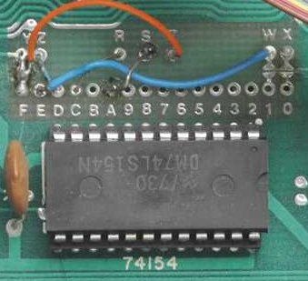

Apple 1 Notes
=============

- [_Apple-1 Operation Manual_][a1man].

The original Apple I used an [MC6820] PIA, but the RC6502 replica uses
an [MC6821].

The Apple I had some additional circuitry to allow the use of a 6501
or 6800; this was basically just to supply a "faster, harder" clock
signal (for the 6800 it also needed to be two phase, because the 6800
used a quadrature clock) to the chip. This was never tested though;
see [yt-6800]. The original 256 byte monitor is in the manual; this
was burned into a pair of 6301-1J PROMs. The cassette board had its
own 256 byte program in PROM. [a1cb-1309]

The reason for choosing the 650x was that Woz liked the indexed
addressing modes. Cost wasn't an issue for him, since he could get a
6800, PIA and UART for $40 through HP. [a1cb-1211]

Memory Map
----------

    $0000 - $7FFF  32K RAM
    $D000 - $DFFF   4K I/O area
    $E000 - $EFFF   4K RAM in original; ROM on most replicas
    $F000 - $FEFF   4K ???
    $FF00 - $FFFF  256 WozMon

### I/O ports

    $D010   KBD: keyboard input register. Valid when KBDCR bit 7 is 1.
            Reads clear KBDCR bit 7.
    $D011   KBDCR: Bit 7 cleared when KBD is read; set when keyboard
            key pressed.
    $D012   DSP: when bit 7 is 0, write bits 0-6 to output char and
            set bit 7.
    $D013   DSPCR: control register for output; init'd by WozMon

### Address Decoding

A 74154 4 to 16 decoder decodes `A15`-`A12` to `C̅S̅0`-`C̅S̅F`, each a 4K
block. These are brought out to pads marked `0`-`F` which then can be
jumpered to device select pads above them:

    Pad    Function      Default    Notes
    -------------------------------------------------------------------------
     Z   6820 PIA C̅S̅2   C̅S̅D $D000   A4 → PIA G̅0: odd 16-byte blocks
     Y   PROM           C̅S̅F $F000   Φ1 → PROM C̅S̅₁; mirrored in full 4K?
     X   RAM X0-7       C̅S̅0 $0000
     W   RAM W0-7       C̅S̅E $E000   Typ. for Integer BASIC, per ACI manual
                        C̅S̅1 $1000   According to note 8 on schematic
     T   slot pin 21        -
     S   slot pin 11        -
     R   slot pin L     C̅S̅C $C000   Typ. for use w/Apple Cassette Interface

The [Apple Cassette Interface (ACI)][aci] required block $C000 decode
to be jumpered to `R` and further decoded A9-A11 = 000 to use address
range $C000-$C1FF. The $C100 page PROM (mirrored in the $C000 page);
access to any address in the $C000 page will toggle the output
flip-flop.

MC6820 Keyboard and Video I/O
-----------------------------

The configuration is the same for both ports (control registers `CRA`
and `CRB`) of the 6820: $A7 = `10100111`. However, though interrupts
are inabled, normally /IRQB and /IRQB outputs are not jumpered to go
through to CPU /IRQ and /NMI, respectively.

- b0-1 (CA1 control) = `11`: enable interrupt when CA1 input goes low to high.
- b2 (DDR access): `1`: other register address is port, not direction register.
- b3-5 (CA2 control) = `100`: CA2 is output, read strobe with CA1 restore.
  CA2 goes low on read from MPU and back to high when CA1 goes low again.
- b6: Read-only: unused because CA2 is not an input.
- b7: Read-only: goes high when CA1 goes high; cleared on MPU read of data.

### Keyboard

The keyboard connector is a DIP-16 socket. It has inputs for 7 data
lines `B1-B7`, a strobe line `STR`, and two NO pushbutton switches for
reset and clearing the screen. `B1-B7` connect to `PA0-PA6` on the
MC6820 PIA; pin 15 also connects to `PA7` but that's expected to be
tied to +5V (note 10 on schematic) because WozMon etc. assumes that
bit 7 of characters is always high.

`STR` (strobe) connects to `CA1`, which is configured to mark data as
available on a low to high transition. (The manual claims that, "The
strobe can be either positive or negative, of long or short duration."
Clearly "strobe" here means it always transitions twice within a short
time of the keypress.)

### Video

For more details see:
- [`charrom`](charrom.md): character ROM
- [`video`](video.md): video display hardware details

On PIA port PB. `PB0-PB6` are outputs, `PB7` is input. `CB1` and `CB2`
both used.

Character output translation:

    $00-$1F  Print nothing (excepting $0D)
        $0D  (CR) Moves to the beginning of the next line.
    $20-$5F  (space through underbar) prints given char
    $60-$7F  (lower-case etc.) prints same as $40-$5F
             ($7F is not treated as a control character)

The high bit is ignored on output, producing the same results as above.

This was confirmed by observing the behaviour of a real Apple 1 in
[this Breker auction video][breker]. The [Apple 1js emulator][a1js]
and [Pom1 1.0.0][pom1] are also consistent with this.

The [nappel1] emulator is quite inaccurate (though convenient to use).
It backspaces and erases the previous character when either `_` or
backspace is typed, prints a space for nonprinting chars, and prints
lower-case.

ROM Software
------------

Original monitor ROM was 2× [Intel 3601] 256b×4.

### ROM Routines

    $E000   Woz BASIC entry point (`E000R` to run)
    $E2B3   Woz BASIC warm entry point (preserves existing program)
    $FF1F   GETLINE: Monitor entry point (CALL -225 from BASIC)
    $FFEF   ECHO: Print char in A to terminal
    $FFDC   PRBYTE: Print value in A as two hex digits
    $FFE5   PRHEX: Print lower nybble of A as a single hex digit

### Woz Monitor

- SB-Projects, [The Woz Monitor][sbp-wozmon].
- Jeff Tranter, [Woz Monitor Source Code][jt-wozmon]

Multiple commands may be given in sequence (numbers must be separated
with spaces); the current location _curloc_ will be used when not
being set.

- _nnnn_: Examine byte value at _nnnn_ and set _curloc_ = _nnnn_+1.
- _.nnnn_: Examine byte values in range _curloc_ through _nnnn_ (eight
  bytes per line); set _curloc_ = _nnnn_+1. Often preceeded by address
  to set/examine _curloc_ above, e.g., _mmmm.nnnn_.
- _nnnn: aa bb ..._: Deposit starting at _nnnn_ bytes _aa_, _bb_,
  etc., set _curloc_ = last loc. deposited + 1, and print previous
  value at _nnnn_.
- _R_: "Run," `JMP` (not `JSR`) to _curloc_. Return to monitor with
  `JMP $FF1F`.

### Woz BASIC

- SB-Projects, ["The Apple 1 Basic"][sbp-basic]

### Apple Cassette Interface (ACI)

The [ACI] contained 256 bytes of PROM with code designed to run from
$C100 (but mirrored into the I/O area at $C000). There's a bug in the
address parsing; always use 4-digit addresses before the `R` and `W`
commands.

### Other Tools

- [Krusader](krusader.md), a symbolic assembly development environment.

<!-------------------------------------------------------------------->
[MC6820]: http://archive.pcjs.org/pubs/c1p/datasheets/pdfs/MC6820.pdf
[MC6821]: http://archive.pcjs.org/pubs/c1p/datasheets/pdfs/MC6821.pdf
[a1cb-1211]: https://apple1computer.blogspot.com/2012/11/early-apple-1-pcb.html
[a1cb-1309]: https://apple1computer.blogspot.com/2013/09/6800-info-from-woz-per-lionel.html
[a1man]: https://www.applefritter.com/files/a1man.pdf
[aci]: https://www.sbprojects.net/projects/apple1/aci.php
[intel 3601]: https://drive.google.com/file/d/0B9rh9tVI0J5mNDc4NDI4NTEtZmU0MC00MTM5LTg3NTMtODk5NDFiODViZDdj/view
[jt-wozmon]: https://github.com/jefftranter/6502/tree/master/asm/wozmon
[sbp-basic]: https://www.sbprojects.net/projects/apple1/a1basic.php
[sbp-wozmon]: https://www.sbprojects.net/projects/apple1/wozmon.php
[yt-6800]: https://www.youtube.com/watch?v=ag6pWUhps7U

[a1js]: https://www.scullinsteel.com/apple1/
[breker]: https://youtu.be/wTgyll6IqJY?t=33
[ca-emul]: https://www.callapple.org/soft/ap1/emul.html
[nappel1]: https://github.com/nobuh/napple1
[pom1]: http://pom1.sourceforge.net/
