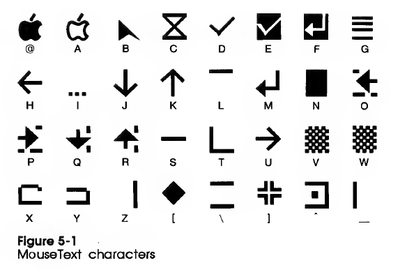

Apple II
========

References:
- \[a2ref] [_Apple II Reference Manual_][a2ref], 1979 edition.
- \[a2cref] [_Apple IIc Technical Reference Manual_][a2cref]
- \[relay] [Jon Relay's Apple II Info Archives][relay]. Memory areas,
  zero page addresses, etc.
- \[sather] Jim Sather, [_Understanding the Apple II_][sather], 1983.
  Detailed hardare description.
- \[lanc84] Don Lancaster, [_Tearing Into Machine Code_][lanc84],
  referenced from [this 6502.org post][p67532]. A small book on Apple
  II architecture and reverse-engineering 6502 software.
- \[bados] Don Worth and Pieter Lechner, [_Beneath Apple DOS_], 1981.

Foreign Versions
----------------

__Apple II j-Plus:__
- Char ROM and input method code switched with annunciator 2 soft switch.
  - $C05C (-16292) = katakana; ^T switches romaji/katakana.
  - $C05D (-16291) = original English mode.
- PSU tweaked for 100 V 50/60 Hz.

See also apple2history.org, [12 - The Apple II Abroad/Clones][abroad].

Memory Map
----------

See [a2ref] Ch.4 pp.67-75. "Programmer's Aid #1" could go in $D000
socket. Applesoft uses all 10K of non-monitor ROM space.

    $F800   2k  ROM (Monitor), Language Card RAM
    $F400   1k  ROM Mini-assembler, etc.
    $E000   5k  ROM (Integer BASIC), Langauge Card RAM
    $D800   2k  ROM (empty socket), Language Card RAM Banks 1 and 2
    $D000   2k  ROM (empty socket), Language Card RAM Banks 1 and 2

    $C800   2k  I/O card ROM space (switched between cards)
    $C000   2k  I/O ($C100, $C200, etc. are slots 1, 2, etc.)

    $6000  24k  Free RAM
    $4000   8k  Screen: hi-res page 1 (secondary)
    $2000   8k  Screen: hi-res page 1 (primary)
    $0C00   5k  Free RAM
    $0800   1k  Screen: text/lo-res page 2 (secondary)
    $0400   1k  Screen: text/lo-res page 1 (primary)
    $0300 308b  Free, or used by programs
    $03D0  32p  DOS 3.3 vector locations
    $03F0  16b  ROM/Monitor vector locations (see p.62)
    $0200   1p  GETLN input buffer
    $0000   2p  Zero page, stack

There are 64 undisplayed locations in each screen text/lo-res page; in
page 1 these are [reserved for I/O cards][jr-screenholes].

The Language Card had 16K of RAM. 8K could be mapped at $E000, and two
4K banks at $D000. Read the following soft switches (which have
[further aliases][relay-io]) to configure the mapping:

    $C080   read RAM (bank 2); write nothing
    $C081   read ROM; write RAM (bank 2)
    $C082   read ROM; write nothing
    $C083   read/write RAM (bank 2)
    $C088   read RAM (bank 1); write nothing
    $C089   read ROM; write RAM (bank 1)
    $C08B   read/write RAM (bank 1)

### Zero-page Usage

The monitor uses the following zero-page and page-3 locations:

    $20--$2F  $30--$3F  $40-$49 $4E $4F  $50-$55   $3F0-$3FF

See further tables in [a2ref] pp. 74-75 for Applesoft, DOS 3.2 and
Integer BASIC usage. Roughly, the only bytes left free by Applesoft
and DOS 3.2 are the following:

    $06-$09  $CE $CF  $D6 $D7  $E3  $EB-$EE $EF  $F9-$FF
    $06-$09                    $E3  $EB-$EE $EF  $F9-$FF  # +Integer BASIC
    $06-$09  $CE $CF                $EB-$EE      $FD $FE  # +ProDOS

SWEET16 uses `$00`-`$1F`.

Video
-----

### Character Set

As described on [pp. 14-16][a2ref 14] of the _Apple II Reference Manual_,
the Apple II character ROM has 64 characters: the two ASCII upper-case
sticks followed by the punctuation and the numbers stick. In the text
buffer the lower 6 bits determine the character code and the upper two
select flashing, inverse, normal and normal text.

                       │     All      │    II    │ Primary  │ Alternate│
    Stick ($x0 - $xF)  │ Inv   Normal │ Flsh Nor │ Flsh Nor │ Inv  Nor │
    ───────────────────┼──────────────┼──────────┼──────────┼──────────┼
    @ABCDEFGHIJKLMNO   │ $0x  $8x $Cx │ $4x      │ $4x      │          │
    PQRSTUVWXYZ[\]^_   │ $1x  $9x $Dx │ $5x      │ $5x      │          │
     !"#$%&'()*+,-./   │ $2x    $Ax   │ $6x  $Ex │ $6x      │          │
    0123456789:;<=>?   │ $3x    $Bx   │ $7x  $Fx │ $7x      │          │
    ───────────────────┼──────────────┼──────────┼──────────┼──────────┼
      [mouse text]     │              │          │          │      $4x │
      [mouse text]     │              │          │          │      $5x │
    `abcdefghijklmno   │              │          │      $Ex │ $6x  $Ex │
    pqrstuvwxyz{|}~░   │              │          │      $Fx │ $7x  $Fx │

The Enhanced IIe and IIc differ ([a2cref] p.360) in having two character
sets, the _primary character set_ with inverse, flashing upper- and
lower-case blocks, and the _alternate character set_ with inverse
upper-case, inverse lower-case, normal upper-case and normal lower-case
blocks.

Flashing display must not be used with enhanced video firmware active, but
only in 40-column mode with enhanced video firmware turned off.

### Mouse Text

[MouseText][] ([a2cref] p.90) is designed for use with GUI programs. The
enhanced video firmware allows printing of these via setting inverse and
mouse text mode and printing the $40-$5F ASCII sticks. From [a2cref] p.91:

[Unicode mappings][mtuni]:

      closed apple          $40   ⌥   U+2325   OPTION KEY (functional replacement)
      open apple            $41   ⌘   U+2318   PLACE OF INTEREST SIGN (functional replacement)
      mouse pointer         $42   🮰   U+1FBB0  ARROWHEAD-SHAPED POINTER
      hourglass             $43   ⌛  U+231B   HOURGLASS
      check                 $44   ✓   U+2713   CHECK MARK
      inverse check         $45   🮱   U+1FBB1  INVERSE CHECK MARK
      inverse enter         $46   🮴   U+1FBB4  INVERSE DOWNWARDS ARROW WITH TIP LEFTWARDS
      title bar             $47   🮁   U+1FB81  HORIZONTAL ONE EIGHTH BLOCK-1358
      left arrow            $48   ←   U+2190   LEFTWARDS ARROW
      ellipsis              $49   …   U+2026   HORIZONTAL ELLIPSIS
      down arrow            $4A   ↓   U+2193   DOWNWARDS ARROW
      up arrow              $4B   ↑   U+2191   UPWARDS ARROW
      top side line         $4C   ▔   U+2594   UPPER ONE EIGHTH BLOCK
      enter                 $4D   ↲   U+21B2   DOWNWARDS ARROW WITH TIP LEFTWARDS
      block                 $4E   ▉   U+2589   LEFT SEVEN EIGHTHS BLOCK
      left scroll           $4F   🮵   U+1FBB5  LEFTWARDS ARROW AND UPPER AND LOWER ONE EIGHTH BLOCK
      right scroll          $50   🮶   U+1FBB6  RIGHTWARDS ARROW AND UPPER AND LOWER ONE EIGHTH BLOCK
      down scroll           $51   🮷   U+1FBB7  DOWNWARDS ARROW AND RIGHT ONE EIGHTH BLOCK
      up scroll             $52   🮸   U+1FBB8  UPWARDS ARROW AND RIGHT ONE EIGHTH BLOCK
      middle line           $53   ─   U+2500   BOX DRAWINGS LIGHT HORIZONTAL
      L corner              $54   🭼   U+1FB7C  LEFT AND LOWER ONE EIGHTH BLOCK
      right arrow           $55   →   U+2192   RIGHTWARDS ARROW
      shade block           $56   ▒   U+2592   MEDIUM SHADE
      inverse shade block   $57   🮐   U+1FB90  INVERSE MEDIUM SHADE
      left half folder      $58   🮹   U+1FBB9  LEFT HALF FOLDER
      right half folder     $59   🮺   U+1FBBA  RIGHT HALF FOLDER
      right side line       $5A   ▕   U+2595   RIGHT ONE EIGHTH BLOCK
      diamond               $5B   ◆   U+25C6   BLACK DIAMOND
      two lines             $5C   🮀   U+1FB80  UPPER AND LOWER ONE EIGHTH BLOCK
      intersect             $5D   🮻   U+1FBBB  VOIDED GREEK CROSS
      close box             $5E   🮼   U+1FBBC  RIGHT OPEN SQUARED DOT
      left side line        $5F   ▏   U+258F   LEFT ONE EIGHTH BLOCK

The first two characters are propietary and have several options for
Unicode equvalents:

    $40 Closed    ⌥  U+2325       OPTION KEY (functional replacement)
        Apple       U+F813       (Linux private use area)
                    U+F8FF       (Apple private use area)
                  🍎 U+1F34E      RED APPLE (graphical repalcement)

    $41 Open      ⌘  U+2318       PLACE OF INTEREST SIGN (func. repl.)
        Apple       U+F812       (Linux private use area)
                   U+F8FF+F87F  (Apple private use area)
                  🍏 U+1F34F      GREEN APPLE (graphical repalcement)

### Video Scan

Screen scan, from [this vapor lock description][vapor]:
- 65 cycles for for each of the 192 scan lines: 40 cycles of drawing
  and 25 cycles of hblank. (65th cycle is stretched.)
- 4550 cyles of vblank (70 scan lines).
- [Sync can be found][rcse 14027] by putting an appropriate pattern
  into the frame buffer and reading the select soft switch for the
  current mode (e.g., $C051 for text mode) which will usually return
  the data most recently read by the last video read φ1 cycle.
- [mmphosis] has sample code to do this.
- The [Apple II Mouse Card][mouse] used a similar technique except that it
  had a flip-flop that would capture `D0` during Φ1; the test would read
  that to figure out a value for the 6522 timer.

Other I/O
---------

#### Paddles/Joystick (Mouse/Hand Controller)

Apple II uses a DIP-16 socket ([a2ref] p.23, p.100), Apple IIc and
others a DE-9 female jack ([a2cref] pp.199, 284, 287 ). Paddle
resistors should be 150 KΩ pots connected to +5V. Paddles are numbered
from 0 to 3.

    5 4 3 2 1     Looking into female jack on motherboard.
     9 8 7 6

    DIP DE9
      1  2   +5V            max 100 mA
      2  7   PB0,GAMESW     paddle 0 button ($C061 b7)
         7   M̅S̅W̅            (IIc) mouse button
      3  1   PB1,GAMESW1    paddle 1 button ($C062 b7)
         1   M̅O̅U̅S̅E̅I̅D̅        (IIc) assert to disable paddles (556 paddle timer)
      4      PB2            paddle 2 button ($C063 b7)
         6   n/c            (IIc) may be paddle 2 button on GS?
      5      C̅0̅4̅0̅ ̅S̅T̅R̅O̅B̅E̅    .5 μs low strobe on read from $C040 (2× on write)
      6  5   GC0,PDL0       paddle 0 pot, joystick 0 X
             XMOVE          (IIc) movement interrupt
      7      GC2            paddle 2 pot, joystick 1 X
      8  3   GND
      ₉                     (GS only) paddle 3 button; not on Apple II
     10  8   GC1,PDL1       paddle 1 pot, joystick 0 Y
         8   YDIR,PDL1      Direction indicator, paddle 1 resistor
     11      GC3            paddle 3 pot, joystick 1 Y
     12                     annunciator 3 ($C05E off, $C05F on)
     13                     annunciator 2 ($C05C off, $C05D on)
     14                     annunciator 1 ($C05A off, $C05B on)
     15                     annunciator 0 ($C058 off, $C059 on)
     16      n/c
         4   XDIR           (IIc only) Direction indicator
         9   YMOVE          (IIc only) Movement interrupt

#### Other

System timing is from a 14.318 MHz master oscillator `14M`, divided
down to `7M`⁼, `COLOR REF`, `Q3`⁼ (2.046 MHz, 60% high duty cycle),
`Φ0`⁼/`Φ2` (1.023 MHz) and `Φ1`⁼ (inverted Φ2). Those marked ⁼ are
available on the peripheral slots.

- Expansion slot pinout and signal descriptions: [a2ref 106].
- [Diskette controllers and drives.](disk.md)

<!-------------------------------------------------------------------->
[a2cref]: https://archive.org/stream/Apple_IIc_Technical_Reference_Manual
[a2ref]: https://archive.org/stream/Apple_II_Reference_Manual_1979_Apple#page/n3/mode/1up
[abroad]: https://www.apple2history.org/history/ah12/#04
[bados]: https://archive.org/stream/Beneath_Apple_DOS_OCR#page/n2/mode/1up
[jr-screenholes]: http://www.kreativekorp.com/miscpages/a2info/screenholes.shtml
[lanc84]: http://forum.6502.org/download/file.php?id=7848
[mmphosis]: http://web.archive.org/web/20151021120320/http://hoop-la.ca/apple2/2015/vbl/
[mouse text]: https://mirrors.apple2.org.za/apple.cabi.net/FAQs.and.INFO/A2.TECH.NOTES.ETC/A2.CLASSIC.TNTS/mouse006.html
[mouse]: https://www.folklore.org/StoryView.py?project=Macintosh&story=Apple_II_Mouse_Card.txt
[mtuni]: https://www.kreativekorp.com/charset/map/mousetext/
[p67532]: http://forum.6502.org/viewtopic.php?f=3&t=5517&sid=f6734cd034b51b20dcd393f67a3c48fe&start=30#p67532
[rcse 14027]: https://retrocomputing.stackexchange.com/q/14027/7208
[relay-io]: https://www.kreativekorp.com/miscpages/a2info/iomemory.shtml
[relay]: https://www.kreativekorp.com/miscpages/a2info/index.shtml
[sather]: https://archive.org/stream/Understanding_the_Apple_II_1983_Quality_Software#page/n0/mode/1up
[vapor]: http://www.deater.net/weave/vmwprod/megademo/vapor_lock.html

[a2ref 106]: https://archive.org/stream/Apple_II_Reference_Manual_1979_Apple#page/n116/mode/1up
[a2ref 14]: https://archive.org/stream/Apple_II_Reference_Manual_1979_Apple#page/n24/mode/1up
[a2ref 90]: https://archive.org/stream/Apple_II_Reference_Manual_1979_Apple#page/n100/mode/1up
