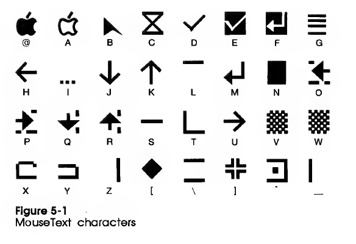

Apple II Video
==============

Character Set
-------------

As described on [pp. 14-16][a2ref 14] of the _Apple II Reference Manual_,
the Apple II character ROM has 64 characters: the two ASCII upper-case
sticks followed by the punctuation and the numbers stick. In the text
buffer the lower 6 bits determine the character code and the upper two
select flashing, inverse, normal and normal text.

                       │     All      │    II    │ Primary  │ Alternate│
    Stick ($x0 - $xF)  │ Inv   Normal │ Flsh Nor │ Flsh Nor │ Inv  Nor │
    ───────────────────┼──────────────┼──────────┼──────────┼──────────┼
    @ABCDEFGHIJKLMNO   │ $0x  $8x $Cx │ $4x      │ $4x      │          │
    PQRSTUVWXYZ[\]^_   │ $1x  $9x $Dx │ $5x      │ $5x      │          │
     !"#$%&'()*+,-./   │ $2x    $Ax   │ $6x  $Ex │ $6x      │          │
    0123456789:;<=>?   │ $3x    $Bx   │ $7x  $Fx │ $7x      │          │
    ───────────────────┼──────────────┼──────────┼──────────┼──────────┼
      [mouse text]     │              │          │          │      $4x │
      [mouse text]     │              │          │          │      $5x │
    `abcdefghijklmno   │              │          │      $Ex │ $6x  $Ex │
    pqrstuvwxyz{|}~░   │              │          │      $Fx │ $7x  $Fx │

The Enhanced IIe and IIc differ ([a2cref] p.360) in having two character
sets, the _primary character set_ with inverse, flashing upper- and
lower-case blocks, and the _alternate character set_ with inverse
upper-case, inverse lower-case, normal upper-case and normal lower-case
blocks.

Flashing display must not be used with enhanced video firmware active, but
only in 40-column mode with enhanced video firmware turned off.

### Mouse Text

[MouseText][] ([a2cref] p.90) is designed for use with GUI programs. The
enhanced video firmware allows printing of these via setting inverse and
mouse text mode and printing the $40-$5F ASCII sticks. From [a2cref] p.91:

[Unicode mappings][mtuni]:

      closed apple          $40   ⌥   U+2325   OPTION KEY (functional replacement)
      open apple            $41   ⌘   U+2318   PLACE OF INTEREST SIGN (functional replacement)
      mouse pointer         $42   🮰   U+1FBB0  ARROWHEAD-SHAPED POINTER
      hourglass             $43   ⌛  U+231B   HOURGLASS
      check                 $44   ✓   U+2713   CHECK MARK
      inverse check         $45   🮱   U+1FBB1  INVERSE CHECK MARK
      inverse enter         $46   🮴   U+1FBB4  INVERSE DOWNWARDS ARROW WITH TIP LEFTWARDS
      title bar             $47   🮁   U+1FB81  HORIZONTAL ONE EIGHTH BLOCK-1358
      left arrow            $48   ←   U+2190   LEFTWARDS ARROW
      ellipsis              $49   …   U+2026   HORIZONTAL ELLIPSIS
      down arrow            $4A   ↓   U+2193   DOWNWARDS ARROW
      up arrow              $4B   ↑   U+2191   UPWARDS ARROW
      top side line         $4C   ▔   U+2594   UPPER ONE EIGHTH BLOCK
      enter                 $4D   ↲   U+21B2   DOWNWARDS ARROW WITH TIP LEFTWARDS
      block                 $4E   ▉   U+2589   LEFT SEVEN EIGHTHS BLOCK
      left scroll           $4F   🮵   U+1FBB5  LEFTWARDS ARROW AND UPPER AND LOWER ONE EIGHTH BLOCK
      right scroll          $50   🮶   U+1FBB6  RIGHTWARDS ARROW AND UPPER AND LOWER ONE EIGHTH BLOCK
      down scroll           $51   🮷   U+1FBB7  DOWNWARDS ARROW AND RIGHT ONE EIGHTH BLOCK
      up scroll             $52   🮸   U+1FBB8  UPWARDS ARROW AND RIGHT ONE EIGHTH BLOCK
      middle line           $53   ─   U+2500   BOX DRAWINGS LIGHT HORIZONTAL
      L corner              $54   🭼   U+1FB7C  LEFT AND LOWER ONE EIGHTH BLOCK
      right arrow           $55   →   U+2192   RIGHTWARDS ARROW
      shade block           $56   ▒   U+2592   MEDIUM SHADE
      inverse shade block   $57   🮐   U+1FB90  INVERSE MEDIUM SHADE
      left half folder      $58   🮹   U+1FBB9  LEFT HALF FOLDER
      right half folder     $59   🮺   U+1FBBA  RIGHT HALF FOLDER
      right side line       $5A   ▕   U+2595   RIGHT ONE EIGHTH BLOCK
      diamond               $5B   ◆   U+25C6   BLACK DIAMOND
      two lines             $5C   🮀   U+1FB80  UPPER AND LOWER ONE EIGHTH BLOCK
      intersect             $5D   🮻   U+1FBBB  VOIDED GREEK CROSS
      close box             $5E   🮼   U+1FBBC  RIGHT OPEN SQUARED DOT
      left side line        $5F   ▏   U+258F   LEFT ONE EIGHTH BLOCK

The first two characters are propietary and have several options for
Unicode equvalents:

    $40 Closed    ⌥  U+2325       OPTION KEY (functional replacement)
        Apple       U+F813       (Linux private use area)
                    U+F8FF       (Apple private use area)
                  🍎 U+1F34E      RED APPLE (graphical repalcement)

    $41 Open      ⌘  U+2318       PLACE OF INTEREST SIGN (func. repl.)
        Apple       U+F812       (Linux private use area)
                   U+F8FF+F87F  (Apple private use area)
                  🍏 U+1F34F      GREEN APPLE (graphical repalcement)

Video Generation Technical Details
----------------------------------

### Video Scan

Screen scan, from [this vapor lock description][vapor]:
- 65 cycles for for each of the 192 scan lines: 40 cycles of drawing
  and 25 cycles of hblank. (65th cycle is stretched.)
- 4550 cyles of vblank (70 scan lines).
- [Sync can be found][rcse 14027] by putting an appropriate pattern
  into the frame buffer and reading the select soft switch for the
  current mode (e.g., $C051 for text mode) which will usually return
  the data most recently read by the last video read φ1 cycle.
- [mmphosis] has sample code to do this.
- The [Apple II Mouse Card][mouse] used a similar technique except that it
  had a flip-flop that would capture `D0` during Φ1; the test would read
  that to figure out a value for the 6522 timer.

### Color Generation

A [VCF post from resman][resman] provides an excellent description. To
summarise:

> It's best to break up the chroma cycle into four pieces: each quarter of
> the chroma cycle representing one fundamental artifact color. The Apple
> IIs video bitstream in HGR mode is twice the chroma frequency, so each
> bit will overlay two quarters of the chroma cycle. Understand that the
> resultant color is additive of the chroma cycle colors. If both bits are
> zero, then black is output, if both are one, then white is output, as it
> covers the complete chroma cycle and the result is the summation of the
> entire cycle, thus producing white. If one bit is one and the other zero,
> then half of the chroma cycle is summed up and output - either the first
> half of the chroma cycle or the second, depending on where the one bit
> falls.

<!-------------------------------------------------------------------->
<!-- Character Set -->
[a2cref]: https://archive.org/stream/Apple_IIc_Technical_Reference_Manual
[a2ref 14]: https://archive.org/stream/Apple_II_Reference_Manual_1979_Apple#page/n24/mode/1up

<!-- Technical Details -->
[rcse 14027]: https://retrocomputing.stackexchange.com/q/14027/7208
[vapor]: http://www.deater.net/weave/vmwprod/megademo/vapor_lock.html
[mouse]: https://www.folklore.org/StoryView.py?project=Macintosh&story=Apple_II_Mouse_Card.txt
[resman]: https://forum.vcfed.org/index.php?threads/understanding-hgr-mode-is-driving-me-insane.1252182/post-1436735
