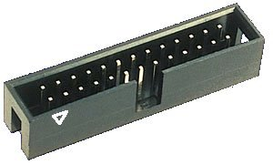

.1" Pin Headers
===============

Pin headers are used both for ribbon cable with IDC connectors and
individually crimped; my numbering tries to keep these compatible. IDC
connectors on ribbon cables are almost invariably female, so boards
generally use male connectors.

Looking into the connector, numbering is counted "forwards" from the lower
left on the male side. Thus this is reversed (counted from lower right)
looking into the female side, and because dupont crimp kits use the same
shroud for both, the triangle marker will be on the high number end (but
same row) for female connectors. Ribbon cables and shrouded connectors put
the alignment notch on the bottom.

    Looking into Male   Looking into Female
     (out of Female)       (out of Male)
         2 4 6 8              8 6 4 2
         1 3 5 7              7 5 3 1
         ▲                    ▲
