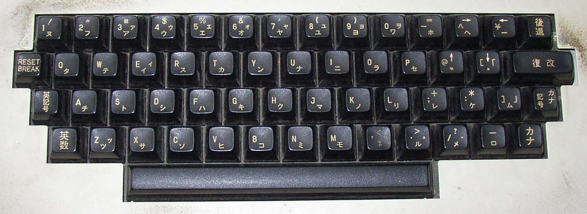
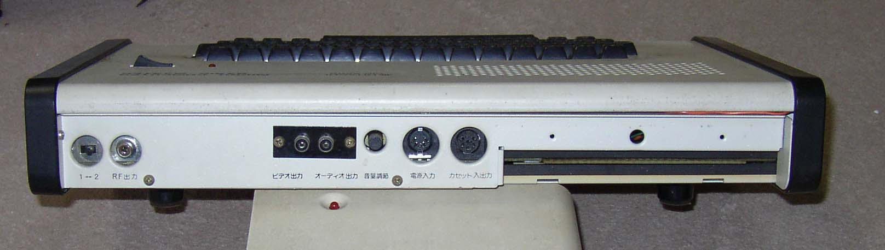

MB-688x Hitachi Basic Master Series
===================================

Versions:
- MB-6880 ベーシックマスター: Original 4K RAM 8K ROM version with
  integer-only BASIC; later renamed to "Level 1" after MB-6880L2 was
  released.
- MB-6880-8: 8K RAM.
- MB-6880L2 ベーシックマスターレベル2: 4K RAM 16K ROM; Level 2 BASIC
  expanded from 4K to 12K and added floating point. floating point.
  Otherwise almost identical with the MB-6880 (perhaps even just using the
  ROM expansion board mentioned below)?
- MB-6881: ベーシックマスターレベル2: 16K RAM, 16K ROM. Almost identical
  (including ports, internals) except for:
  - color of keyboard surround
  - only 2 ROM sockets filled (8K ea?); 3rd (bottom) was pads w/no socket.
  - heard there were SW compatibility problems between L2 and L2 II.
- [MB-6885 Basic Master Jr.](./6885.md) (separate file)

Ports on back:
- Channel 1/2 switch; RF output (RCA)
- Video output (RCA); audio output (RCA); volume pot
- Power input (DIN-5F); CMT I/O (DIN-6F)
- Expansion bus (2×28 edge connector)

Power from MP-10 external PSU. Appears to be 17V 0.4A, 9V 1.2A, -10V 0.1A.
And there are what look like three linear regulators each w/large heat sink
on mobo. (One readable one on MB-6881 is labeled "B566", and 3rd one is
marked Q103 on mobo, but what would be the need for 2SB566 PNP
transistors?) MB-6881 also has an extra power connector coming off the
motherboard giving MP-6881 board has a connector giving -5 blue, +12 red,
black, 5? yellow.

Internals:
- Speaker mounted on a wooden board on top panel. Keyboard and power switch
  also there; reaminder was a single PCB on the bottom panel.
- There were 16 sockets for 4K×1 or 4116 16K×1 DRAM; fill right side first.
  - base model: half-filled for 4K
  - MB-6880-8: both filled for 8K
  - MB-6881: half-filled w/HM4716A-3 for 16K
  - RAM. [[04mat]] shows a fully expanded 32K RAM system; as well as
    changing the jumper this required adding a couple of caps to the timing
    circuit.
- Socketed DIP-24W "NEC D2316EC" (IC65) to left of RAM sockets; perhaps a
  2316 2K PROM? Video charset? (XXX Check charset matrix size.)
- 3 sockets for ROM. Top one was 4K and contained Level 1 BASIC (integer
  only); it could be replaced with 3× 4K "MB-ROM" board with a Level 2
  BASIC (floating point). Another 4K was for the monitor. Third one was
  perhaps video charset? Seems unlikely to be a "printer" ROM.

Memory maps:

    0000  ½K  System work area
    0100  ¾K  Display RAM (32×24 chars)
    0400      BASIC Work Area
    05C0      Level 1 BASIC text (work area for Level 2)
    0A00      Level 2 BASIC text
    7FFF      Max RAM
    8000      Unmapped?
    B000 12K  Level 2 BASIC ROM
    D000  4K  Level 1 BASIC ROM
    E000  4K  I/O space
    F000  4K  Monitor ROM

References:
- [[04mat]]: description, external/internal pics, memory map.
- [Ordenador Hitachi MB-6881 BASIC Master L2 II (1980)][roo6881]
- [作品展。写真印刷トラブル。日立BASIC MASTER MB-6880 MB-6881セット][keikato]
  Just photos showing 6880 and 6881 side-by-side.

<!-------------------------------------------------------------------->
[04ma]: http://mb6880.soom.jp/MB6880/index.html
[keikato]: https://keikato.cocolog-nifty.com/blog/2017/02/post-fd68.html
[roo6881]: https://retroordenadoresorty.blogspot.com/2018/12/ordenador-hitachi-mb-6881-basic-master.html
