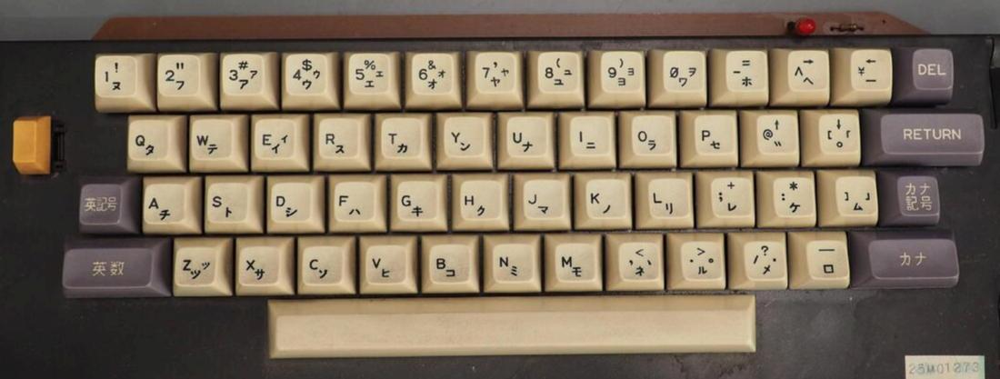

MB-6885 Hitachi Basic Master Jr.
================================

- Power: internal PSU, 100 V, 50/60 Hz, 13 W (mobo 12 V, 5 V)
- Size: 39.5 × 9.7 × 32.7 cm, 4.5 kg
- Specs (manual p.166):
  - MPU 6800, ROM 18 KB, RAM 16 KB
  - Display: B/W 32×24 uppercase chars, 256×192 dots (2 pages), 64×48 dots
  - Keyboard: 56 key JIS (no case shift keys)
    - Alps mechanical keyboard; 12 pin and 13 pin connections
  - Cassette: 300/1200 baud Kansas City standard (1200 from ROM upgrade)
  - Parallel printer interface
Options:
  - MP-9785 adds expanded RAM (64K?) allowing full RAM address space
    excepting I/O area.
  - MP-1710 Color Adapter (on expansion bus) allows 8-color graphics.
  - MP-1803/MP-3370 3" floppy controller/drive. (MA-5380 Disk BASIC.)

High-res system image [here][hires].  
Keyboard (yellow key is `BREAK/RESET`):

This the same layout as the  [MB-6881 keyboard][oh81kb] ([source][oh81])
except for relabeling `後退`→`DEL` and `復改`→`RETURN`.

Emulators:
- [bm2]: Linux source and Win32 binary available. Boots into a weird screen
  that may indicate it's got its own tiny, free ROM instead of the standard
  ROMs.

Assembly Notes
--------------

Internal assemblies have no internal screws except keyboard.
External screws also thread through and hold internal components.
All screws are self-tapping into plastic, no bushings.

### Socketed ICs

- IC1:  HD46800DP (HD6800P) CPU
- IC9:  D2364C (ROM?)
- IC10: D2364C (ROM?)
- IC11: MP9730 2365942 UV-erasable PROM (1200 baud update?)
- IC48-55: NEC D4116-2 16K×1 dynamic RAM ×8
- IC78: D2316EC (char ROM?)

### Major non-socketed ICs:

- IC84: HD46821P (HD6821P) parallel I/O
- Can contains only "12702" crystal and 74LS parts

### Internal Connectors

To remove, lift clip on side slightly w/flathead screwdriver, pull up
slightly, then press on motherboard while pulling straight up. (Lifting
clip first may not be necessary.)

Wire harnesses are EIA coded: Brown=1 ROYGBVGW Black=10 Brown/stripe=11, etc.

From back left to front right:
- `D` 6-pin: PSU (GND/+5/-5/+12 and others?)
- `A` 12-pin: near printer port, unused
- RCA video soldered to board but slides out of back panel
- `C` 2-pin: speaker
- `F` 12-pin: keyboard
- `E` 13-pin: keyboard

Keyboard does not need to be plugged in to operate.

<!-------------------------------------------------------------------->
[bm2]: http://ver0.sakura.ne.jp/pc/index.html#bm2
[hires]: https://photos.app.goo.gl/rYa7rnKMH8vaZ5m78
[oh81]: https://retroordenadoresorty.blogspot.com/2018/12/ordenador-hitachi-mb-6881-basic-master.html
[oh81kb]: https://4.bp.blogspot.com/-UiocbdB0osU/XAAEwuiYw8I/AAAAAAAAPuQ/ITPgx18Tq3Q2K_N6kp84ZfnRIZlRq9P9ACLcBGAs/s1600/hitachi%2Bmb6881%2BF.jpg
