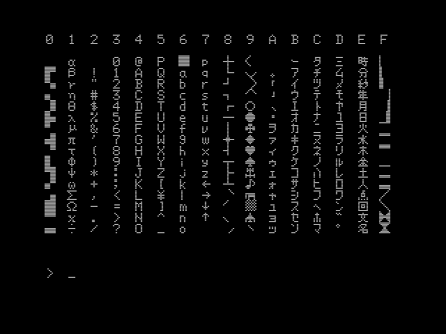

Hitachi MB-68xx Video
---------------------

MB-6885 Basic Master Jr.
------------------------

B/W output only. MP-1710 Color Adapter (on expansion bus) adds a separate
graphics system for 8-color graphics.

The following character set screenshot was taken from the `bm2` emulator.
(The program that produced it is on p.74 of the manual.) A character set
chart is also given in the [manual p.47 P.53]. The printable ASCII sticks
differ from ASCII in substituting `\{|}~` → `¥←→↓↑`.

Text screen memory at $100-$3FF.

Generic Peripherals
-------------------

### MP-9780 VHF Color Converter

Converts B/W or color output from DRGB to composite and VHF television
signals.

- Input: DIN-8 270° input for B/W (composite?) video (MB-68xx) or DRGB (MB-69xx)
- Outputs: video out (CVBS color); VHF out (ch2/ch3, internal jumper)

Input pin assignments:

    1   white   +12V    power input into 7805 regulator
    2   bare    GND     ground
    3   black   P̅       (unknown function?)
    4   brown   H̅       (hsync?)
    5   yellow  V̅       (vsync?)
    6   red     R       red
    7   green   G       green
    8   blue    B       blue

<!-------------------------------------------------------------------->
[manual p.47 P.53]: https://archive.org/details/Hitachi_MB-6885_Basic_Master_Jr/page/n52/mode/1up?view=theater
