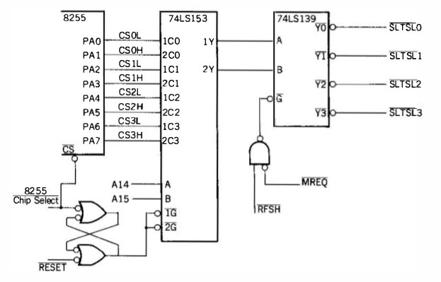

MSX Address Decoding
====================

References:
- \[td1] [_MSX Technical Data Book_][td1], Sony, 1984.
  MSX1 hardwre and software.
- [RAM and Memory Mappers][mw ramm], msx.org wiki.

Though the hardware is described below, the MSX standard strongly suggests
using BIOS routines to change page and slot mappings, do cross-slot calls,
etc.

### Address Space Pages

The MSX address space is divided into four 16 KB _pages._ Each page has a
separate setting (two bits of PPI (i8255) port A (PA0-PA7) usually at IO
port $A8) that determines the primary slot that should respond to accesses
to locations in this page.

      Page  Addr.range  $A8  Typical use
       3    C000-FFFF   7,6  RAM
       2    8000-BFFF   5,4  empty; additional RAM
       1    4000-7FFF   3,2  BIOS/BASIC ROM; expansion ROM
       0    0000-3FFF   1,0  BIOS/BASIC ROM

#### Primary Slots / 基本スロット

Devices responding to address space read/write requests are in one of four
_primary_ slots, 0-3, corresponding to select lines `S̅L̅T̅S̅L̅0` through
`S̅L̅T̅S̅L̅3`. These are routed to onboard devices or the `S̅L̅T̅S̅L̅` line (slot
select, pin 4) on the corresponding cartridge connector based on the bit
pair for that page (set to 0-3) in PPI port_A described above.

    | $C000 | $8000 | $4000 | $0000 | Pages 3-0
    |  7 6  |  5 4  |  3 2  |  1 0  | $A8 port bits containing slot number (0-3)

      Slot 0    System slot (onboard ROM, RAM)  required
      Slot 1    Cartridge slot 1                required
      Slot 2    Cartridge slot 2                optional
      Slot 3    Expansion bus connector         optional

The schematic from [td1 p.30] makes the decoding clear:

#### Expansion Slots / 拡張スロット

Each primary slot may optionally support up to four "expansion" slots
associated with the primary slot, assigned _secondary slot numbers_ 0
through 3. Expansion slot decoding is done by the primary slot device
(suggested scheamtic at [td1 p.35]). The standard specifies that when a
primary slot is selected for page 3, it should latch any write to $FFFF and
interpret it as:

    | 7 6 | 5 4 | 3 2 | 1 0 |  $FFFF bits
    |  3  |  2  |  1  |  0  |  Page # sub-slot setting (0-3)

Reads from $FFFF should return the latched value inverted (i.e., XOR $FF,
or 0 for 1 and 1 for 0 for all bits). This allows the BIOS (or any other
routines) to determine whether a primary slot has expansion slots.

#### Initialization

At startup the BIOS is presumably mapped into page 0 and 1. It scans
through the primary slots and their expanded slots, if present, at at
$8000, $C000 and, if the $C000 scan failed, $E000 (to support 8K systems)
to detect RAM, mapping in the first RAM that it finds for each page. It
then scans at $4000 and $8000 for pages starting $AB, which is the
cartridge ROM signature, and maps in the first one it finds.

### Memory Mapper / メモリマッパ

There's another method of bank switching called a [Memory Mapper][mw mapper]
(and sometimes "MegaMapper") that uses I/O ports $FC-$FF to map arbitrary
16K "segments" from an expansion slot containing up to 4 MB of RAM to each
of the four pages ($FC for page 0, etc.). (For other kinds of paging
devices, generally just the term "mapper" is used. Cartridge ROM mappers
generally use the term "banks" instead of "segments.")

Most Memory Mappers power up with all four pages mapped to segment 0; this
will confuse most MSX1 BIOSes. MSX1 machines with a built-in Memory Mapper
(such as the Yamaha [CX5MII]) will have a BIOS that properly initializes
things. For other machines, see [Memory mappers on MSX1][mmap-msx1] for
details on how to work around this.

The specification (which I can't find) says that the registers are
write-only, but some software relies on them being readable. [This internal
2MB/4MB memory expander][koryakin] uses a 74'373 to enable reading back the
outputs of the latches it uses to set the segment mapped to each page. A
system having more than one mapper with readback can have conflicts.
Without readback, writing a mapper port sets the same value for mappers,
but of course only the selected primary/expansion slot's memory will be
seen.

MSX-DOS 2 can apparently use this mapper (as well as plain expansion slot
memory?) and provides [an API][dos2mem] for for temporary (disappears with
TPA when program exits) and permanent allocation of pages. MSX-DOS 2 seems
to allow the program to change pages at will and MSX-DOS will preserve
these over API calls. MSX-DOS 2 is not listed as a program that would
require readback, so this presumably means that you must only switch
segments using the facilities provided by the DOS API.

References:
- MSX Wiki: [Memory Mapper][mw mapper]
- MSX Assembly Page: I/O ports overview [§ Memory Mapper registers][ma mmr]

XXX Reverse-engineer [this BASIC program](https://www.msx.org/wiki/Memory_Mapper#How_to_know_if_Main-RAM_is_in_a_memory_mapper)
that determines the mapper config. (Requires MSX-DOS 2?)

I/O Address Map
---------------

[[td1 p.40]]. All I/O is supposed to be done via BIOS calls, except VDP. (See
notes below table.) Some MSX machines will not let cartridge slots respond
to certain I/O port requests. Much more detailed information at MSX
Assembly Page [MSX I/O ports overview][ma iopo].

    FC-FF   MSX2 Memory Mapper (write-only registers†)
              FF page 3 memory segment select (BIOS default 00)
              FE  "   2   "       "      "    (BIOS default 01)
              FD  "   1   "       "      "    (BIOS default 02)
              FC  "   0   "       "      "    (BIOS default 03)

    F8-FF   MSX1: reserved

    F7      Audio/Video Control
              b7 video select  0=TV
              b6 Ys control    0=Super
              b5 Ym control    0=TV
              b4 AV control    0=TV

    F0-F6
    E0-F0
    D8-DF   Kanji ROM
    D0-D7   (FDC) Floppy Disk Controller
    C0-CF   (MSX-AUDIO $C0-$C3)
    B8-BF   Light pen interface (Sanyo)
    B5-B7
    B4      Calendar clock
    B0-B3   External memory (Sony HBI-55, Yamaha UDC-01)

    A8-AF   PPI (8255): A8
              A8:  w  port A: address slot select (CS0L, CS0H, CS1L, ...)
              A9: r   port B: keyboard matrix sense
              AA:  w  port C: [td1 p.43] Bits:
                          7  SOUND    software-controlled sound output
                          6  CAPS     CAPS lamp          0=on
                          5  CASW     CMT write signal
                          4  CASON    CMT motor control  0=on
                        3-0  KB3-KB0  keyboard matrix row select
              AB: rw  mode register

    A0-A7   PSG (AY-3-8910). [td1 p.44] for bit assignments
              A0: addr latch
              A1: data write
              A2: data read

    98-9F   VDP (TI 9918A)
              98: video ram data
              99: command/status reg.

    90-97   printer
              90: b0 (w) strobe, b1(r) busy state
              91: (w) print data

    88-8F
    80-87   RS-232C
    40-7F   Reserved
              7C,7D: MSX-MUSIC register select/data

    00-3F   Unspecified

Notes and references for I/O systems above:
- $FC-$FF Memory Mappers: see "Memory Mappers" section above.
- $D0-$D7 FDC: Floppy disk controllers should have a disable mechanism so
  multiple FDCs can be present.
- $B0-$B3: Sony [HBI-55] or Yamaha [UDC-01] cartridge with 4K of
  battery-backed static RAM accessed through an 8255 PPI on I/O ports
  $B0-$B3. From the [schematic][HBI-55 SM] this appears to support up to
  16K of external memory. PA0-PA7=A0-A7, PB0-PB5=A8-A13, PB6=CS?/CS?,
  PB7=/WR, PC0-7=D0-7.
- $98-$9F VDP: ROM bytes at $0006 and $0007 contain correct VDP read/write
  register I/O addresses for the current machine.

<!-------------------------------------------------------------------->
[CX5MII]: https://www.msx.org/wiki/Yamaha_CX5MII
[dos2mem]: http://map.grauw.nl/resources/dos2_environment.php#c5
[koryakin]: https://hansotten.file-hunter.com/do-it-yourself/memory-mappers-slots/2mb-4mb-internal-slot-expander/
[ma iopo]: https://map.grauw.nl/resources/msx_io_ports.php
[ma mmr]: https://map.grauw.nl/resources/msx_io_ports.php#mmapper
[mmap-msx1]: https://www.msx.org/wiki/Memory_Mapper#Memory_mappers_on_MSX1
[mw mapper]: https://www.msx.org/wiki/Memory_Mapper
[mw ramm]: https://www.msx.org/wiki/RAM_and_Memory_Mappers
[td1 p.40]: https://archive.org/stream/MSXTechnicalHandbookBySony#page/n42/mode/1up
[td1]: https://archive.org/stream/MSXTechnicalHandbookBySony#page/n5/mode/1up

[HBI-55]: https://www.msx.org/wiki/Sony_HBI-55
[UDC-01]: https://www.msx.org/wiki/Yamaha_UDC-01
[HBI-55 SM]: https://archive.org/details/sony55hbmsm/page/n2/mode/1up
