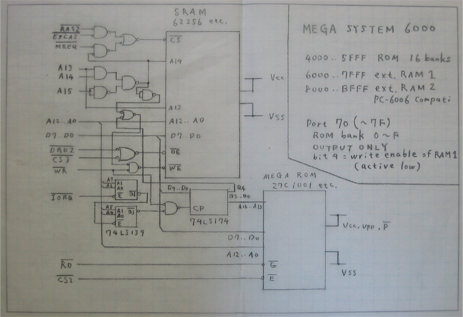

NEC PC-6001
===========

Rather different from the 8xxx series; it was done by NEC Home Electronics,
rather than the microcomputer/electronic device division.

Original PC-6001 used a Motorola 6847; the mkII replaced that with custom
video logic with much nicer colours and display.

Memory Map
----------

The internal 16K RAM is mapped from $C000-$FFFF. The RAM expansion cart
adds RAM from $8000-$BFFF. [[tsutsui]] Some software will not operate when
32 KB of RAM is available. For ROM see [BELUGA] schematic below.

Connectors
----------

### Cartridge Port

Famicom edge connectors may work with this.

Pins 1,3,… are on the lower side, and 2,4,… on the upper side. [[p6ram]].

     1  /RAS2            2  /CS3
     3  /DRD2            4  /CS2
     5  /WE              6  /EROM
     7  /OCS5            8  /EXINT
     9  /M1             10  /EXCAS
    11  /IORQ           12  /MREQ
    13  /WR             14  /RD
    15  /RST            16  /MPX
    17  A9              18  A15
    19  A11             20  A10
    21  A7              22  A6
    23  A12             24  A8
    25  A14             26  A13
    27  A1              28  A0
    29  A3              30  A2
    31  A5              32  A4
    33  D1              34  D0
    35  D3              36  D2
    37  D5              38  D4
    39  D7              40  D6
    41  GND             42  CLK0
    43  GND             44  MSW1
    45  +5V             46  MSW2
    47  +5V             48  +12V
    49  -5V             50  -12V

RAM and ROM Expansion
---------------------

Simple RAM decoding. [[p6ram]] [[tsutsui]] has a more detailed explanation,
and uses an extra gate to be able to switch on and off (via disabling CS)
his internal RAM expansion.

    /CS  =  /RAS2 ∙ /EXCAS      pins 1 and 10
    /OE  =  /DRD2               pin 3
    /WE  =  /WE                 pin 5

Nishida Radio's [BELUGA] board has decoding for larger RAM and ROM:

References
----------

- \[tsutsui] tsutsuiの作業記録置き場, [PC-6001 本体内蔵 32KB
  RAM増設改造][tsutsui]. Technical info and how to do an internal RAM
  expansion, with a very clever SOP build directly on to the motherboard.
  The blog has many other PC-6001 posts as well.
- \[p6ram] Ｐ６つくろうブログ, [PC6001用拡張RAM][p6ram]. Schematic and
  board pictures for RAM expansion from 16K to 32K.

<!-------------------------------------------------------------------->
[p6ram]: http://sbeach.seesaa.net/article/387861385.html
[BELUGA]: http://tulip-house.ddo.jp/digital/BELUGA/
[tsutsui]: https://ch.nicovideo.jp/tsutsui/blomaga/ar1315944
