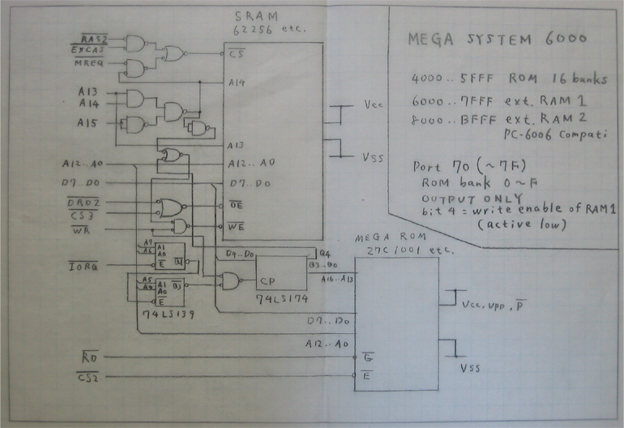
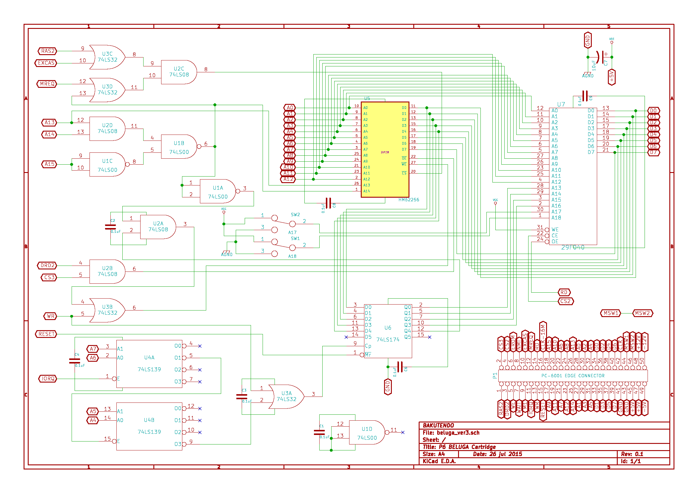

NEC PC-6001
===========

Rather different from the 8xxx series; it was done by NEC Home Electronics,
rather than the microcomputer/electronic device division.

Original PC-6001 used a Motorola 6847; the mkII replaced that with custom
video logic with much nicer colours and display.

With a cart, the later models (mkII etc.) will boot with 16K of RAM enabled
by default; hold down `2` during start up to enable 32K. (You can restart
after a delay with `FOR I=0 TO 999:NEXT:EXEC 0`.)

Models and Accessories
----------------------

- __PC-6011__ expansion unit. Plus into cartridge slot on the side; adds
  three cartridge slots and 36-pin Centronics/57-series mini-ribbon
  connector for floppy kit (same parallel interface as PC-8001).

### Floppy Disk

NEC "intelligent type" floppy disk drives (e.g. PC-8031, PC-80S31) can be
but use of the drive requires Extended BASIC cartridge to be booted.
connected through the aforementioned PC-6011 interface to original models,

The PC-6001 appears unable to boot from floppy disks, even those with the
`SYS` header and when using an Extended BASIC cartridge. [[p6tech fdd]]

Memory Map
----------

    $C000   16K     Internal RAM
    $8000   16K     External RAM
    $6000    8K     External ROM 1  read asserts /CS3
    $4000    8K     External ROM 0  read asserts /CS2
    $0000   16K     BASIC ROM

The external RAM/ROM are usually added via a PC-6006 expansion cart.
Some software will not operate with 32K of RAM.

The system startup checks for `AB` (`$41 $42`) at at $4000; if present it
will jump to the (little-endian) vector at $4002. `RET` will continue to
BASIC startup ("How many pages?") only on PC-6001, not later models. (???)
See [[cartstart]] for more information on cartridge startup, including
returning to BASIC after optionally installing extensions.

### BASIC Map

Screen areas 2-4 are program text if the screen is not allocated.
DOS uses additional work area below the standard ROM work areas.
Extended BASIC uses additional work area below screens 2-4.
[p6ers basmem]

     16K   32K
    FA00  FA00  work area for BASIC and BIOS
    E000  E000  screen 2
          C000  screen 3
          A000  screen 4
    C400  8400  program text
    C000  8000  screen 1
    6000        unused (cart ROM area)
    400         Extended BASIC ROM, if present
    0000        ROM

### I/O Map

More detailed information in [[MPC-P60]].

    $D0-$FF     Unused: reserved
    $C0-$CF     Printer busy
    $B0-$BF     Timer; page switching; CMT motor
    $A0-$aF     8910 sound; joystick
    $90-$9F     8255 PIA for printer; 8049 (MCS-48?); CGROM select
    $80-$8F     8251 USART for RS-232C
    $00-$7F     Unused: free for expansion devices

Connectors
----------

### Cartridge Port

50-contact 2.54mm pitch edge connector, like Famicom and MSX. The [MPC-P60]
is a protoboard that will work for both PC-6001 and MSX (and many other
things that use a 50-contact edge connector).

Pins 1,3,… are on the lower side, and 2,4,… on the upper side.

     1  /RAS2            2  /CS3 (read of $6000-$7FFF)
     3  /DRD2            4  /CS2 (read of $4000-$5FFF)
     5  /WE              6  /EROM
     7  /OCS5  WAIT      8  /NMI  /EXINT
     9  /M1             10  /EXCAS
    11  /IORQ           12  /MREQ
    13  /WR             14  /RD
    15  /RESET          16  CK-16M /MPX
    17  A9              18  A15
    19  A11             20  A10
    21  A7              22  A6
    23  A12             24  A8
    25  A14             26  A13
    27  A1              28  A0
    29  A3              30  A2
    31  A5              32  A4
    33  D1              34  D0
    35  D3              36  D2
    37  D5              38  D4
    39  D7              40  D6
    41  GND             42  CLK0
    43  GND             44  MSW1
    45  +5V             46  MSW2
    47  +5V             48  +12V
    49  -5V             50  -12V

There is a switch in the slot that powers off the computer as a cartridge
is inserted. To power the computer back on, `MSW1` and `MSW2` must be
shorted together to turn the power back on. However, a bare board will not
trigger the slot switch, making the `MSW1/2` short unnecessary.

`CS2` and `CS3` are _asserted for reads only_; writes will not assert these.

`/RAS2`, `/DRD2`, `/WE` and `/EXCAS` are RAM-related signals.

`/EROM`  is somehow related to the internal ROM; it is stated that it is
"for disabling internal BASIC ROM."

RAM and ROM Expansion
---------------------

Simple RAM decoding. [[p6ram]] [[tsutsui]] has a more detailed explanation,
and uses an extra gate to be able to switch on and off (via disabling CS)
his internal RAM expansion.

    /CS  =  /RAS2 ∙ /EXCAS      pins 1 and 10
    /OE  =  /DRD2               pin 3
    /WE  =  /WE                 pin 5

Nishida Radio's [BELUGA] board has decoding for larger RAM and ROM:

Video
-----

The PC-6001mkII DIN-8F "COLOR CRT" jack has a switch near it:
down for digital (RGBI) and up for analog (RGB).

    1   YS     Color television "cut" signal (screen off?)
    2   GND
    3   I      intensity (digital)
        CSYNC  (analogue)
    4  /HSYNC
    5  /VSYNC
    6   R      red (analog 75Ω; digital TTL)
    7   G      green (analog 75Ω; digital TTL)
    8   B      blue (analog 75Ω; digital TTL)

### Video Programming

[PC-6001 SCREEN MODE4 の色滲みを調べる][vid4] discusses (in huge detail,
including an intro to NTSC color) games that use NTSC color artificts.

References
----------

- \[cartstart] Ｐ６つくろうブログ, [ROMカートリッジについて][cartstart].
  Information on cartridge startup: take-over, extend BASIC and do-nothing;
  compatibility with different PC-6001 models.
- p6ers.net, [PC-6001用の8KByte ROMカードを作ってみる][p6ers ROM]. Detailed
  memory map and expansion bus pin info; plans for a large ROM expansion
  card.
- \[p6ers basmem] p6ers.net, [N6x BASIC リファレンス－付録２：メモリマップ
  ][p6ers basmem]
- \[p6ram] Ｐ６つくろうブログ, [PC6001用拡張RAM][p6ram]. Schematic and
  board pictures for RAM expansion from 16K to 32K.
- \[tsutsui] tsutsuiの作業記録置き場, [PC-6001 本体内蔵 32KB
  RAM増設改造][tsutsui]. Technical info and how to do an internal RAM
  expansion, with a very clever SOP build directly on to the motherboard.
  The blog has many other PC-6001 posts as well.
- [PC-6001 ベルーガカートリッジ作成 【１号機】][bt beluga]. Beluga v3
  schematic and build pictures.
- Bakutendo [PC-6001 category][bt pc6001]. Lots of good blog entries on
  PC-6001 stuff.
- \[MPC-P60] [ユニバーサル基板 ＭＰＣ－Ｐ６０ 添付資料]. Documents a
  cartridge protoboard and PC-6001 and MSX interfacing.
- \[p6tech fdd] PC-6001シリーズ技術情報いろいろ. _PC-6001 series various
  technical information_.
  Hand-gathered accumulation of various PC-6001/mkII/6601 knowledge.
- [sbeach.seesaa.net] is the blog for a project to create the PC-6001F, an
  FPGA clone of the 6001. It has articles with extensive information on
  many aspects of PC-6000/PC-8000 hardware and software.

<!-------------------------------------------------------------------->
[BELUGA]: http://tulip-house.ddo.jp/digital/BELUGA/
[MPC-P60]: http://madlabo.oops.jp/NEW/supp/20141006-16A.pdf
[bt beluga]: https://bakutendo.net/blog-entry-287.html
[bt pc6001]: https://bakutendo.net/blog-entry-category/pc-6001
[cartstart]: http://sbeach.seesaa.net/article/394230579.html
[p6ers ROM]: http://p6ers.net/mm/pc-6001/dev/flashromcard/8k.html
[p6ers basmem]: http://p6ers.net/hashi/furoku2.html
[p6ram]: http://sbeach.seesaa.net/article/387861385.html
[p6tech fdd]: http://000.la.coocan.jp/p6/tech.html#auto_fd
[sbeach.seesaa.net]: http://sbeach.seesaa.net/
[tsutsui]: https://ch.nicovideo.jp/tsutsui/blomaga/ar1315944
[vid4]: http://p6ers.net/mm/pc-6001/dev/screen4color/
