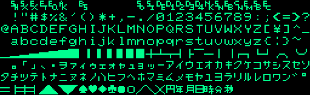

NEC PC-8001 Series
==================

The Z80-based __PC-8001__ was one of the first micros introduced into
Japan, in 1979-09, preceeded only by the Hitachi Basic Master. It could run
CP/M. On the original 8001 the PC-8011 expansion unit or PC-8033 adapter is
required to connect the floppy drive unit.

- 1981-08 __PC-8001A:__ US release. Katakana replaced with Greek.
- 19??-?? __PC-8001B:__ European release (240V). [Pictures][retropc.net/404].
- 1981-12 PC-8801: series run in parallel until end of PC-8001
- 1983-03 __PC-8001mkII:__ Improved graphics (V1?), many expansion modules
  (including FDC) built-in, two expansion slots. Perhaps closer to an
  8801mkII than the original 8001.
- 1983-10 PC-8801mkII: First machine with FDC/FDDs in system unit
- 1985-01 PC-8801mkII xR: V2 graphics mode
- 1985-03 __PC-8001mkIISR:__ Improved graphics again.

Specs (also see [[rcp80spc]]):
- CPU: μPD780C-1 (Z80 clone), 4 MHz.
- Memory: 16/32 KB, VRAM included on PC-8001, later models separate
- ROM: 24 KB + 1 empty 8 KB 2716? PROM socket
- Video: μPD2301, b/w composite, RGBI. Programmable CRTC; 4K VRAM (mkII: 32K).
- Text: 40×20/8, 80×25/8; graphics can be intermixed.
- Graphics: 160x100/8, 4×2 pixels per character cell; one color per cell.
  (mkII: add 320x200/4.)
- BASIC: N-BASIC, variant of MS Disk Basic 4.51
- TOD clock (access w/`TIME$` in BASIC)
- Back panel:
  - PC-8001: power cord, POWER, RESET, TAPE (DIN-9), B/W (DIN-5), COLOR
    (DIN-8), PRINTER (keyed edge connector), EXT BUS (keyed edge connector)
  - PC-8001mkII: XXX check, but included expansion slot, PORT (DE-9M)
  - PC-8001mkIISR:
    - Upper row: expansion slot, power switch, power cord.
    - Lower row: printer (micro-ribbon), RS-232 (DB-25F), FDD? (micro-ribbon),
      switches, knob, RCA, DIN, DIN, DIN, DIN, RESET (button).

Peripherals (Ⅱ marks mkII items); see also [[hb68]] p.73, [[rcp80mn]]:
- __PC-8001mkII-01:__ Kanji board for mkII dedicated connector (not exp. slot)
- __PC-8006:__ Extra RAM (IC set?)
- __PC-8011:__ Expansion unit: [[hb68]] p.75
  - Low-profile (~10 cm?), ¥148,000
  - 32K RAM sockets ($0000-$7FFF when ROM disabled; CP/M, UCSD Pascal, etc.)
  - 8K ROM socket (how different from onboard?)
  - RS-232C interface (DB-25F?)
  - FDC I/O port (i8255 parallel interface to FDC control/drive unit)
  - GPIO (8 and 4 bit output ports, 8 and 4 bit input ports)
  - IEEE-488 interface
  - Expansion I/O bus for user-supplied devices (card slots?)
  - Interrupt controller (8 interrupts, 16 levels)
  - Interval timer (for RS-232C, prob., also "RTC")
  - "Real-time Interrupts": every 1.66 ms; from Interval timer?
- __PC-8012:__ I/O unit: [[hb68]] p.76
  - Tall (~25 cm?), ¥84,000
  - 7 sockets (slots?) for additional cards (up to 4× 32K RAM boards)
  - 2K PROM socket
  - FDC I/O Port
  - Interrupt controller
  - "Real-time Interrupts": every 1.66 ms; from Interval timer?
- __PC-8012-01:__ 8012 universal board (for making boards)
- __PC-8012-02:__ 32K RAM board. Up to 4 bank-switched into ROM area.
  Read and write may be separate banks, and 2 or more banks may be written
  at the same time.
- __PC-8012-03:__ Voice recognition board.
- __PC-8023:__ 80-column dot-matrix printer
- __PC-8031:__ (-1W?) 2× (1V=1×) 5.25" SSSD 143K FDD unit w/controller ¥310,000
- __PC-8032:__ 2× 5.25" expansion unit for 8031 (¥268,000)
- __PC-8031-2W:__ 5.25" DSDD 320K FDD unit w/controller (2 drives installed)
- __PC-8032-2W:__ 2-drive expansion unit for 8031-2W
- __PC-80S31:__ Ⅱ2× 5.25" 2D FDD with controller
- __PC-80S32:__ Ⅱ2× 5.25" 2D FDD w/o controller (expansion unit)
- __PC-8033:__ "FDD I/F" (standalone version of that included in PC-8011/12).
- __PC-8041:__ 12" green display
- __PC-8042:__ 12" color display (low-res)
- __PC-8044:__ TV colour adapter
- __PC-8045:__ Light pen
- __PC-8046:__ 9" green display
- __PC-8049:__ 12" color display (high-res)
- __PC-8062:__ RS-232C I/F
- __PC-8091:__ Color display cable
- __PC-8092:__ Monochrome display cable
- __PC-8093:__ CMT cable
- __PC-8094:__ Printer cable
- __PC-8095:__ RS-232C cable
- __PC-8096:__ IEEE-488 cable
- __PC-8097:__ GP-IB Interface Set
_ __RM-210:__ Cassette tape recorder
- __PC-8801-11:__ ⅡFM sound; SR compatibility for 8001mkII, 8801, 8801mkII.

The specs (SS/DS and SD/DD) for the various drive units, and whether any
had just one drive installed rather than two, are not clear, and ja/en
Wikipedia don't entirely agree with each other.

Documentation:
- [Byte Magazine review][byte], Jan. 1981. w/block diagram, chip names.
- [パソコンPCシリーズ 8001 6001 ハンドブック][asahi], covers BASIC, machine
  language, hardware details, etc.
- [Enri's PC-8001 page][enri]:
- [sbeach.seesaa.net] is the blog for a project to create the PC-6001F, an
  FPGA clone of the 6001. It has articles with extensive information on
  many aspects of PC-6000/PC-8000 hardware and software.
- [electric.com][er] has many posts on various PC-8001 topics.
- [PC-8001でマシン語 : VRAMアドレス取得のテストコード][expgig]
- \[hb68] [パソコンPCシリーズ 8001 6001 ハンドブック][hb68]. Covers PC-8001
  and PC-6001 BASIC, memory maps, disk formats, peripheral lists, and all
  sorts of further technical info.
- \[rcp80] [Retro Computer People PC-8001 Models/Parts Lists/specs/etc.][rcp80]
- \[EnrPc] [ＰＣ－８００１][EnrPc]. Extensive internals info and
  memory/interrupt maps, including PC-8011, PC-8012, PC-80S31, PCG8100,
  serial mouse.
- \[kuni] [KUNINET BLOG: 1970年代のマイコンとか電子工作とか][kuni].
  Details schematics etc. for recreation of many PC-8001 peripherals.

Connector Pinouts
-----------------

See [DIN Connectors](../hw/din-connector.md) for pin numbering details.

#### RGBI (8-pin 270° DIN)

Sources:
- [デジタル RGB コンポーネント・アダプタ][nr-drgb]
- [PC-8001用RGBケーブルを作成してみよう！！ ][hkjunk0], which also has
  information on converting it via passive parts only to analogue RGB.
- [デジタルRGB(8ピン）はアナログRGBの夢を見れるか？ ][def_int].

(WARNING: This pinout needs to be confirmed on the hardware; Nishida
Radio claims the same pinout for the PC-8801mkII and first-gen FM-7,
but [Leaded Solder][ls-pc88cv] has a PC-8801mkII pinout with green/red
swapped and +12V on pin 3.)

    ＃      PC-8001mkII     備考
    1       VCC (12V?)      N/C
    2       GND
    3       Clock(14MHz)    N/C
    4       HSync           水平同期信号 (TTL or video level?)
    5       VSync           垂直同期信号 (TTL or video level?)
    6       Red
    7       Green
    8       Blue
    GND     GND             外周のシールド

Roughly, the passive conversion described above and in
[X1のデジタルRGB出力をSONYのTVのAVマルチ入力端子につなぐ実験][kenko858] is:
- To get composite sync, run hsync and vsync each into a 1N4148, tie the
  ouputs together with a 200Ω pulldown. 330Ω works too.
- Run R, G, B through 150Ω resistors, per [x1/rgb21]?

See also [RGBコンバータ(11)][sb-rgb11] (and updates [here][sb-rgb13] for an
FPGA-based RGB converter project.

#### B/W Composite (5-pin 180° DIN)

From my testing, pin 2 is ground and pin 3 is composite output. Others
were not clear.

The [Byte review][byte] claims that the 5-pin connector provides +12V.

#### CMT/Cassette (8-pin 270° DIN)

600 bps FSK Kansas City (1200/2400 Hz).

Motor relay included. (Toggle w/`MOTOR` in Basic.)

This pinout from [Enri's PC-8001][enri]:

    1   GND
    2   GND           Signal ground
    3   GND
    4   CMTOUT  out   Cassette record (red)
    5   CMTOUT  in    Cassette playback (white)
    6   REM+    out   Remote signal (black)
    7   REM-    out   Remote signal (black)
    8   GND           Signal ground

The pinout for the PC-6001mkII in [NEC PC-6001mkII 取扱説明書][pc6001]
is the same except:

    1   CMT1    out   Cassette control signal 1
    3   CMT2    out   Cassette control signal 2

PC-8801 pins 1 and 3 are `VCC` and `/ INT5`.

#### RS-232

The original PC-8001 has an internal jumper block for baud rate [[hb68]] p.91:

                                         ×16     ×64
             CN8                1-2     4800    1200
       ┌─────────────┐          1-3     2400     600
     1 │ ○ ○ ○ ○ ○ ○ │ 6        1-4     1200     300
       └─────────────┘          1-5      600     150
                                1-6      300      75

#### Floppy Disk

- [Hardware interface and commands](floppyif.md).
- [Disk data format](floppy.md).

#### Expansion Cards

The pinout is documented at [【コネクタ】 PC-8001,PC-8801シリーズ
拡張スロット][er519]. It varies slightly between the PC-8012 expansion
unit, PC-8001mkII and PC-8801. That page refs a 1984-10 I/O magazine
article, [「マイクロプロセッサを比較する10：BUSについて３」][IO8410p238],
that covers the expansion buses for all three systems.

See [PC-8001mk2 拡張ボード][er78] for an example of a homebrew
expansion card on protoboard adding a parallel port, ROM writer and FM
sound generator.

Character Set and Colors
------------------------

RGBI colors (0-7): black, blue, red, magenta, green, cyan, yellow, white.

B/W composite output colors are:
- Bit 0: 0 = visibile, 1 = invisible.
- Bit 1: 0 = no flash, 1 = flash.
- Bit 2: 0 = normal, 1 = reverse.

Memory Map
----------

Overview ([[hb68]] p.85):

    C000 FFFF 16K   Standard RAM
    F300 F3B7       VRAM
    8000 BFFF 16K   Expansion RAM
    6000 7FFF  8K   Expansion ROM (unpopulated socket)
    0000 5FFF 24K   BASIC

    $f300-$feb8       Screen memory (see Byte article)

Special addresses (prob. much more at [[EnrPc]]):

    F1E3            RST $38 target
    F1E0            RST $30 target
    F1DD            RST $28 target
    F1DA            RST $20 target
    E9FF            start of BASIC string area (grows down)
    C021            start of BASIC text (16K system)
    8021            start of BASIC text (32K system)

    PC-8011 ROM BASIC Interrupt table
    801E                INT 0
    801C                INT 1
    801A                INT 2
    8018                INT 3
    8016                INT 4
    8017                INT 5
    8012                INT 6
    8010                INT 7
    800E                INT 8 GPIO parallel
    800C                INT 9 GPIO parallel
    800A                RS-232 Ch2
    8008                RS-232 Ch1
    8006                (unused)
    8004                "real time clock"
    8002                IEEE-448
    8000                IEEE-448

    8000H-8001H: IEEE-448
    8002H-8003H: IEEE-448
    8004H-8005H: Real
    - time clock 8006H-8007H: Unused
    8008H-8809H: RS-232C Ch1　
    800AH-800BH: RS-232C Ch2　
    800CH-800DH: / INT9 General
    - purpose parallel 800EH-800FH: / INT8 General
    - purpose parallel 8010H-8011H: / INT7
    8012H-8013H: / INT6
    8014H-8015H: / INT5
    8016H-8017H: / INT4
    8018H-8019H: / INT3
    801AH-8019H: / INT2
    801CH-8011DH: / INT1
    801EH-801FH: / INT0

    5C66            monitor restart
    3F71            error message
    34C1            BASIC reserved words (keywords)
    279C            MAKINT routine
    0F7B            INP 担当機能
    0F75            INKEY$ 担当機能
    0D60            printer output routine
    0D5D            monitor (BASIC keyword routine)
    0257            crt output routine

[ROM images for PC-8001 and PC-8001mkII][rom] (including font ROM).

The ROM area can be replaced by 32K RAM from the PC-8011 or one of up to
four banks of 32K RAM from the PC-8012. It appears that for the 8011 all
writes to $0000-$7FFF write to RAM, and writing any value to I/O port $E2
changes reads from ROM to RAM. For the 8012, port $E2 takes the following
output values. ($E7 also used in sample code below; not clear what it
does.)

    $10     write bank 0
    $01     read bank 0
    $11     write/read bank 0
    $00     no read/write bank 0

The following are `DEFUSR0=&hFF80: A=USR(0)` routines that will copy the
BASIC ROM to low RAM and switch it in, restarting BASIC with a 40K text
area. ([[hb68]] pp.76-77):

    ;   PC-8011
    FF80: 01 00 60  ld bc,$6000     ; N.B.: In Z80 assembly, "n" is immediate
    FF83: 11 00 00  ld de,$0000     ;   value, "(n)" is contents of address.
    FF86: 21 00 00  ld hl,$0000
    FF89: ED B0     ldir            ; [HL]→[DE] decrementing BC until 0
    FF8B: D3 E2     out ($E2),a
    FF8D: C3 E9 17  jp $17E9        ; BASIC cold entry (no h/w init or CLS)

    ;   PC-8012
    FF80: 3E 01     ld a,1
    FF82: D3 E7     out ($E7),a
    FF84: 3E 10     ld a,$10
    FF86: D3 E2     out ($E2),a
    FF88: 01 00 60  ld bc,$6000
    FF8B: 11 00 00  ld de,$0000
    FF8E: 21 00 00  ld hl,$0000
    FF91: ED B0     ldir
    FF93: E3        ex (sp),hl      ; swap HL and top word on stack
    FF94: 11        ld (de),a
    FF95: D3 E2     out $(E2),a
    FF97: C3 E9 17  jp $E917

ROM Notes
---------

If `STOP` key is being held down while the reset button is pushed, the
system will warm start (like `RST 8`) instead of cold start (`RST 0`).

### RST Disassembly

    RST $00  ;  Cold start (reset)
             0000: F3           di          ; disable interrupts
             0001: 31 FF FF     ld sp,$FFFF
             0004: C3 3B 00     jp reset
             0007: 00
    RST $08  ;  Warm start (stop+reset)
             0008: C3 6A 00     jp $006A
             000B: C3 57 17     jp $1757
             000E: AB           xor e
             000F: F0           ret p       ; ? flag
    RST $10  0010: C3 59 42     jp $4259
             0013: C3 6A 00     jp $006A
             0016: DA 0C        db $DA,$0C
    RST $18  0018: C3 A6 40     jp $40A6
             001B: F3           di
             001C: 0B           dec bc
             001D: C3 7E 50     jp $507E
    RST $20  0020: C3 DA F1     jp $F1DA    ; to user-set jump instruction
                                            ; (defaults to `ret`)
             0023: C3 9C 27     jp $279C
             0026: 88           adc a,b     ; data?
             0027: 0C           inc c
    RST $28  0028: C3 DD F1     jp $F1DD    ; to user-set jump instruction
             002B: C3 60 0D     jp $0D60
             002E: 46           ld b,(hl)   ; data?
             002F: 0C           inc c
    RST $30  0030: C3 E0 F1     jp $F1E0    ; to user-set jump instruction
             0033: 9F           sbc a,a     ; data?
             0034: 0F           rrca        ; rotate A right through carry
             0035: C3 57 02     jp $0257    ; CRT output routine
    RST $38  0038: C3 E3 F1     jp $F1E3    ; to user-set jump instruction

    reset:   003B: AF           xor a
             003C: 32 75 EA     ld sp,$EA75
             003F: CD F1 0C     call $0CF1

I/O Ports
---------

Bit 7 0=internal 1=external. Bits 6-4 are device code, 3-0 are registers
within a device ("order code"). [[hb68]] pp.92-93, [[rcp88io]].

    F0-FF   Floppy disk control
    E0-EF   PC-8011 system control
            - E4: RS-232C channel usage initial setting
            - E0-E3: modes 0-3
    D0-DF   IEEE-488
            - D8 control signal input
            - D3 8255 control
            - D2 control signal output
            - D1 data in
            - D0 data out
    C0-CF   RS-232C interface (C1=channel 1; C2=channel 2)
    B0-BF   GPIO (outputs to high level on system reset)
            - B3: 4-bit output
            - B2: 4-bit input
            - B1: 8-bit output
            - B0: 8-bit input
    80-AF   expansion I/O (free)
    70-7F   unused
    60-6F   DMA control
    50-5F   CRT control
    40-4F   IN: printer busy, ack; OUT: printer, beep
    30-3F   CPU system control
    20-2F   8251 USART
    10-1F   printer output
    00-0A   Keyboard input row registers (0 bits indicate key down in row).
            See keyboard map [hb68] p.94-95 or ./8801.md map rows 0-9.
            Rows 0-1 are numeric keypad.

<!-------------------------------------------------------------------->
[EnrPc]: http://www43.tok2.com/home/cmpslv/Pc80/EnrPc.htm
[asahi]: https://archive.org/details/PC8001600100160011982
[byte]: https://tech-insider.org/personal-computers/research/acrobat/8101.pdf
[enri]: http://www43.tok2.com/home/cmpslv/Pc80/EnrPc.htm
[er]: https://electrelic.com/
[expgig]: https://expertgig.jp/2021/02/22/pc-8001でマシン語-vramアドレス取得のテストコード/
[hb68]: https://archive.org/stream/PC8001600100160011982#page/n5/mode/1up
[kuni]: https://kuninet.org/
[rcp80]: https://retrocomputerpeople.web.fc2.com/NEC/8001/
[rcp80mn]: https://retrocomputerpeople.web.fc2.com/machines/nec/8001/mdl80.html
[rcp80spc]: https://retrocomputerpeople.web.fc2.com/machines/nec/8001/spc80.html
[rcp88io]: https://retrocomputerpeople.web.fc2.com/machines/nec/8801/io_map88.html
[retropc.net/404]: http://www.retropc.net/mm/archives/404
[rom]: https://ia902908.us.archive.org/view_archive.php?archive=/33/items/NEC_PC_8001_TOSEC_2012_04_23/NEC_PC_8001_TOSEC_2012_04_23.zip
[sbeach.seesaa.net]: http://sbeach.seesaa.net/

<!-- Connector Pinouts -->
[IO8410p238]: https://archive.org/details/Io198410/page/n238/mode/1up?view=theater
[def_int]: https://web.archive.org/web/20191127114212/blogs.yahoo.co.jp/def_int/34113679.html
[er519]: https://electrelic.com/electrelic/node/519
[er78]: https://electrelic.com/electrelic/node/78
[hkjunk0]: https://hkjunk0.com/computer/hardware-and-maintenance/pc8001-rgb-output.html
[kenko858]: http://kenko858.blog.fc2.com/blog-entry-4.html
[ls-pc88cv]: https://www.leadedsolder.com/2018/09/24/pc88-colour-video.html
[nr-drgb]: http://tulip-house.ddo.jp/DIGITAL/DIGITAL_RGB_COMPONENT/
[pc6001]: https://archive.org/details/PC6001mkII
[sb-rgb11]: http://sbeach.seesaa.net/article/450572908.html
[sb-rgb13]: http://sbeach.seesaa.net/article/450981469.html
[we-pc8000]: https://en.wikipedia.org/wiki/PC-8000_series
[wj-pc8000]: https://ja.wikipedia.org/wiki/PC-8000シリーズ
[x1/rgb21]: http://www.retropc.net/mm/x1/rgb21/index.html
