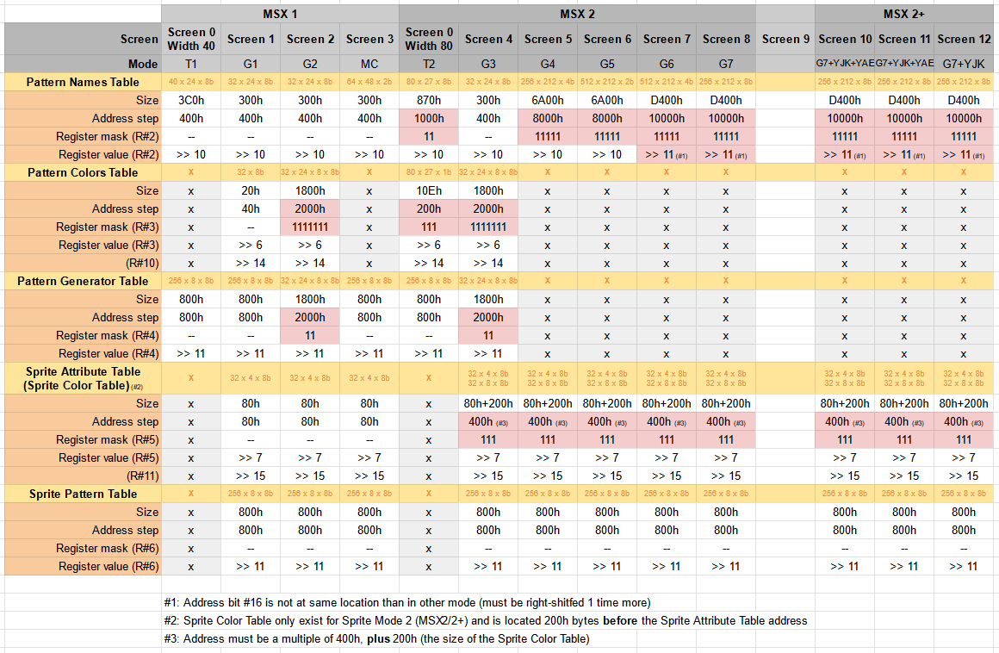

TMS9xxx Video Chips and Compatibles
===================================

References:
- Texas Instruments, [TMS9918A/TMS9928A/TMS9929A Video Display
  Processors][tms-vdp]. Refrences below [TI s-p] for section/page.
- [Sony HB-10P/10B Service Manual][hb10sm], P.39. Pinouts of TMS and T6960.
- MSX.org Wiki, [Toshiba T6950][mw-t6950]

#### Overview

- All specs below for base units; sucessors upgraded these.
- 9918 has external video in and composite out; 9928/9 luma,R-Y,B-Y
- Separate 4K, 8K, 16K (most common) DRAM; VDP handles refresh.
- 256×192 output, 15 colors + transparent. Modes:
  - Graphics I, II: 8×8 pattern (32×24).
  - Text: 6×8 patterns (40×24), no sprites.
  - Multicolor: 64×48 bitmap (4×4 solid color blocks).
- 32, 8×8 or 16×16 sprites w/zoom; max 4/line.

### Colors

    00 transparent                  08 medium.red
    01 black                        09 light.red
    02 medium.green                 0A dark.yellow
    03 light.green                  0B light.yellow
    04 dark.blue                    0C dark.green
    05 light.blue                   0D magenta
    06 dark.red                     0E gray
    07 cyan                         0F white

These provide only eight grey levels:
- 01, 04, 0C/06, 02/05/08/0D, 03/07/09, 0A, 0B/0E, 0F

See [TI 2-17] for luminance, chromanance and Y/R-Y/B-Y values.

Pinouts
-------

Adapted from a [TI list server post][tilist] excerpting the
"TMS9118/TMS9128/TMS9129 Data Manual":

The 9118/9128/9129 VDP's are the succesors of the 9918A/9928A/9929A VDP's.
These new chips have improved memory addressing circutry which allows the
interface of either 8 TMS4116 (2k) or 2 TMS4416 (8K) dynamic RAMs.

                                    VDP PROCESSOR TYPE
          ┌───U───┐
      RAS ┤1    40├ XTAL1      9118     9128/29  9918A    9928A/29A
      CAS ┤2    39├ XTAL2      =======  =======  =======  =========
      AD7 ┤3    38├ ......     CPUCLK   R-Y      CPUCLK   R-Y
      AD6 ┤4    37├ ......     NC       CPUCLK   GROMCLK  GROMCLK
      AD5 ┤5    36├ ......     COMVID   Y        COMVID   Y
      AD4 ┤6    35├ ......     EXTVDP   B-Y      EXTVDP   B-Y
      AD3 ┤7    34├ RESET/SYNC
      AD2 ┤8    33├ vCC
      AD1 ┤9    32├ RD0
      AD0 ┤10   31├ RD1
      R/W ┤11   30├ RD2
      vSS ┤12   29├ RD3
     MODE ┤13   28├ RD4
      CSW ┤14   27├ RD5
      CSR ┤15   26├ RD6
      INT ┤16   25├ RD7
      CD7 ┤17   24├ CD0
      CD6 ┤18   23├ CD1
      CD5 ┤19   22├ CD2
      CD4 ┤20   21├ CD3
          └───────┘

VRAM pins:
- `AD0` (MSB) … `AD7` (LSB): out, VRAM address bus
- `RD0` (MSB) … `RD7` (LSB): I/O, VRAM data bus
- `CAS`: out, VRAM column address strobe
- `RAS`: out, VRAM row address strobe
- `R/W`: out, VRAM write strobe

System bus pins:
- `CD0` (MSB) … `CD7` (LSB): I/O, CPU data bus
- `CSR`: in, CPU-VDP read strobe
- `CSW`: in, CPU-VDP write strobe
- `INT`: out, CPU interrupt output
- `MODE` in, CPU interface mode select (address line or select)

Other pins:

      SIGNATURE PIN I/O DESCRIPTION
      ========= === === ======================================================
     RESET/SYNC 34   I  Trilevel input; below 0.8v - initalizes the VDP
                        above 9v sync - sync input for EXTVDP
           vCC  33   I  +5v supply
           vSS  12   I  Ground reference
         XTAL1  40   I  10.738635 MHz crystal connection
         XTAL2  39   I  10.738635 MHz crystal connection

9918/28/29 Differing Pins:

    SIGNATURE   PIN I/O DESCRIPTION
    =========== === === =====================================================
    EXTVDP       35  I   Multiple TMS9118 VDP operation
    B-Y          35  O   Blue color difference output

    COMVID       36  O   Composite Video Output
    Y            36  O   Y (Black/White luminance and composite sync) output

    NC           37      Reserved - Do not use
    CPUCLK       37  O   CPUCLK equals XTAL/3 (color burst freq)

    CPUCLK       38  O   CPUCLK equals XTAL/3 (color burst freq)
                         Can be used as an external clock
    R-Y          38  O   Red color difference output

### Toshiba T6960

Software-compatible chip, but:
- different pinout in 42-pin DIP.
- 2× clock rate?
- Both NTSC and PAL available; pin 36 `NTSC/P̅A̅L̅`determines which.

Pinout:

                          ┌───U───┐
                      R̅A̅S̅ ┤1    42├ HCLK 1    half clock
                      C̅A̅S̅ ┤2    41├ HCLK 2
                    R̅E̅S̅E̅T̅ ┤3    40├ XTAL 1
           MSB        AD0 ┤4    39├ XTAL 2
                      AD1 ┤5    38├ TEST
                      AD2 ┤6    37├ COMVID    composite video out
                      AD3 ┤7    36├ NTSC/P̅A̅L̅
                      AD4 ┤8    35├ O̅E̅
                      AD5 ┤9    34├ Vdd       +5V
                      AD6 ┤10   33├ RD7       MSB
           LSB        AD7 ┤11   32├ RD6
                       W̅E̅ ┤12   31├ RD5
                      GND ┤13   30├ RD4
                     V̅R̅/̅W̅ ┤14   29├ RD3
                      C̅S̅W̅ ┤15   28├ RD2
                      C̅S̅R̅ ┤16   27├ RD1
                      I̅N̅T̅ ┤17   26├ RD0       LSB
           LSB        CD0 ┤18   25├ CD7       MSB
                      CD1 ┤19   24├ CD6
                      CD2 ┤20   23├ CD5
                      CD3 ┤21   22├ CD4
                          └───────┘

### MSX2 Series

64-pin shrink-DIP; approx same size as DIP-40W.

- V9938 (YM2701): 512×212 (424i) 16/512 colors; 256×212 (424i) 256 colors.
- V9958 (YM2703):YJK mode, Amiga-HAM-like 19,268 colors

Interface
---------

Two read/write ports selected by MODE pin (strobed by /CSR and /CSW):
- MODE=0 __VDP_VRAM:__ reads/writes _curaddr_ then increments _curaddr._
- MODE=1 __VDP_STATUS/CTRL:__ reads status reg, two-byte (LSB followed by MSB)
  writes to one of eight registers selected by data written. Be careful to
  avoid interrupts reading status between control byte LSB/MSB writes.

### Status Register

Reading this:
- Resets two-byte write sequence to accepting byte 1.
- Resets interrupt, if set.
- External reset pin low for 3ms also resets flags reset by read.

Format (note LSbit/MSbit reversal in [TI 2-6] as [TI 2-5] below):

* b7:   F  interrupt flag:  1=end of last line scan or not yet reset. 0=scanning
        - Cleared (reset) on status read.
        - Must be manually reset every frame or will always be 1.

* b6:   5S: Fifth sprite on single line. Set only when F=0.
        - 5 or more sprites on any line 0-192.
        - If set when F=0, remains set until reset by read of this register.

* b5:   C  coincidence flag:  1=2+ sprites coincide. 0=no coincidence
        - At least one overlapping pixel, on or off screen.
        - Includes transparent color, but not unset pixels.
        - Sprites after SAT terminator not checked.
        - Cleared (reset) on status read.

* b4-0: Fifth Sprite Number: valid whenever 5S=1.

### Control Register

> [!WARNING]
> Writing a control register destroys _curaddr._

The above is based on, "The CPU address is destroyed by writing to the VDP
register." [TI 2-1] The diagram on 2-2 indicates one pair of LSB/MSB
registers near CPU data port, which probably store the two most recent
bytes sent.

Write formats (LSB/MSB for _curaddr_):

    MODE  1st(LSB)  2nd(MSB)  Operation
    ───────────────────────────────────────────────────────────────────
      0   aaaaaaaa  00aaaaaa   Setup VRAM and curaddr for read.
      0   aaaaaaaa  01aaaaaa   Setup VRAM and curaddr for write.
      1   dddddddd  10000rrr   Write data to register rrr.

Control registers (writes destroy curaddr). Note that in [TI 2-5] etc.
they call the MSbit "bit 0" and the LSbit "bit 7", reversed from normal
usage and what we use below.

* 0 (%000): (cleared on reset)
  - b7–2: reserved; must be 0
  - b1:   M3 mode bit 3 (see modes below)
  - b0:   external input:  0=disabled. 1=enabled (black on 9928/9)

* 1 (%001): (cleared on reset)
  - b7: 4/16K DRAM selection:  0=4K (4027) DRAM. 1=8/16K (4108/4116) DRAM
  - b6: BLANK screen all border color:  0=blank. 1=active
  - b5: IE interrupt enable:  0=disabled. 1=enabled
  - b4: M1 mode bit 1: (see modes below)
  - b3: M2 mode bit 2: (see modes below)
  - b2: Reserved: must be 0.
  - b1: Sprite size:  0=8×8. 1=16×16
  - b0: Sprite magnification:  0=1×. 1=2×

* 7 (%111): Text/Background Colors
  - b7-4: Text color 1
  - b3-0: Text color 0 / Background color (all modes)

The remaining control registers are the most significant bits of 14-bit
table addresses; the multipliers are given below.

* 2 (%010): NT Name Table base address `0000aaaa` = ×$400
  - $0000, $0400, $0800, $0C00, $1000, …, $3C00

* 3 (%011): CT Color Table base address `aaaaaaaa` = ×$40
  - $0000, $0040, $0080, $00C0, $0100, …, $3FC0

* 4 (%100): PGT Pattern Generator Table base address `00000aaa` = ×$800
  - $0000, $0800, $1000, $1800, …, $3800
  - Pattern, Text or Multicolor generator.

* 5 (%101): SAT Sprite Attribute Table base address `0aaaaaaa` = ×$80
  - $0000, $0080, $0100, $0180, $0200, …, $3F80

* 6 (%110): SPT Sprite Pattern Table base address `00000aaa` = ×800
  - $0000, $0800, $1000, $1800, …, $3800

Note that tables may overlap if later portions of them are not used.

### Display Layers

Back (lowest priority) to front (highest priority for display):
- Black
- External VDP input (color diff → sync level on 9928/9)
- Backdrop (background): solid color, or transparent to let through
  external VDP input or black.
- Patterns (character oriented)
- Sprite 31
- …
- Sprite 0kkk

Mixing of external input must be done separately on the 9928 and 9929:
when the colour difference signals move to sync level (which is not seen
in normal operation) that indicates to show the external signal instead.
(This explanation is totally unclear, but there's a schematic [TI 2-15].)

### Modes

Mode bits are always given in M1,M2,M3 order; which are R1b4, R1b3, R0b6.

    M1 M2 M3   Mode
    ──────────────────────
     0  0  0   Graphics I
     0  0  1   Graphics II
     0  1  0   Multicolor
     1  0  0   Text (sprites disabled)

Notes:
- Tables may overlap if later portions of them are not used.
- Switching table base addresses immediately updates screen; usable for
  fast animation.
- [TI 3-3 P.46] gives charts showing VRAM table address derivations.
- [TI 3-4 P.47] gives examples of memory allocation.

#### Graphics I Mode (%000) [TI 2-17 P.26]

- NT (Name Table): 768 entries × 1 = 768 bytes
  - Entries: Row 0: 0-31; Row 1 32-63; …; Row 23 736-767.
  - Each entry is an 8-bit index into PGT (Pattern Generator table)

- PGT (Pattern Generator Table): 256 entries × 8 = 2048 bytes
  - Entries: 0→$000-$007, 1→$008-$00F, 2→$010-$017, …, 255→$7F8-$7FF.
  - Each entry is 8 bits × 8 rows: 1=color 1, 0=color 0 from PCT entry.

- PCT (Pattern Color Table): 32 entries × 1 = 32 bytes
  - Entries: $00:pats $00-$07, $01:pats $08-$0F, …, $1F:pats $F8-$FF.
  - Entry: b7-4=color1. b3-0=color0.

Addressing summary:

     ₁₃ . . . ₉ ₈ ₇ ₆ ₅ ₄ ₃ ₂ ₁ ₀
      ├base─┤ ├──row──┤ ├column─┤    NT Name Table base/row/column
     ₁₃ . . . ₉ ₈ ₇ ₆ ₅ ₄ ₃ ₂ ₁ ₀
      ├bas┤ ├─────name────┤ ├─0─┤    PGT Pattern Generator Table
     ₁₃ . . . ₉ ₈ ₇ ₆ ₅ ₄ ₃ ₂ ₁ ₀
      ├────base─────┤ 0 ├─name──┤    PCT Pattern Color Table

#### Graphics II Mode (%001) [TI 2-19 P.28]

Similar to Graphics I but each pattern has two colours/byte and full 768
pattern entries so you can have unique one for each name table entry.
PGT and PCT are expanded to give this.

- NT (Name Table): as Graphics I, but PGT entries used are:
  - Rows $00-$07: PGT $0000-$07FF
  - Rows $08-$0F: PGT $0800-$0FFF
  - Rows $10-$17: PGT $1000-$17FF

- PGT (Pattern Generator Table): 768 entries × 8 = 6144 bytes
  - Entries: 0→$000-$007, 1→$008-$00F, 2→$010-$017, …, 768→$17F8-$17FF.
  - Each entry is 8 bits × 8 rows: 1=color 1, 0=color 0 from PCT entry.

- PCT (Pattern Color Table): 768×8 entries × 1 = 6144 bytes
  - Each entry corresponds to one line of the PGT.
  - Entry: b7-4=color1. b3-0=color0.

#### Multicolor Mode (%010) [TI 2-21 P.30]

- NT (Name Table): 768 entries × 1 = 768 bytes
  - Each entry maps 4 pixels: A upleft, B upright, C lowleft, D lowright.
  - Entries: Row 0: 0-31; Row 1 32-63; …; Row 23 736-767.
  - NT entry b7-2 map PGT entry: b0-1 map bytes 0-1, 2-3, 4-5, 6-7 in that
    PGT entry.

- PGT (Pattern Generator Table):
  - Each pair of bytes (4 pairs/entry) gives 4 nybbles A,B,C,D that give
  the colour for the respective pixels from the NT.

#### Text Mode (%100) [TI 2-23 P.32]

40-columns; characters are 6×8 (user supplies intra-char spacing).
Sprites are not available.

- NT (Name Table): 40 cols × 24 rows = 960 bytes
  - Entries: row   0→0-39,    row   1→40→79,   …, row  23→929-959
  - Entries: row $00→$00-$27, row $01→$28-$4F, …, row $18→$398-$3BF

- PGT (Pattern Generator Table): 256 entries × 8 = 2048 bytes
  - As Graphics I, but last two columns in each row are ignored and
    colors set by VDP register 7.

#### Tables Summary

 <!--  1160 x 758 -->
(Source: aoineko, MSXGL author.)

Sprites
-------

Only 4 highest priority sprites are displayed on any one line.

Sprites use two tables: [TI 2-25 P.34]

* SAT (Sprite Attribute Table): 32 entries × 4 bytes = 128 bytes
  - Defines where sprite is located on screen.
  - Ordered sprite 0 (top) through sprite 31 (bottom).
  - $D0 vertical ends processing of this table (to shorten it).
  - Entry is 4 bytes:
    - B0: vert pos:  $FF = abuts top border; $E1-$FE hides under border
    - B1: horiz pos: $00 = abuts left border; early clock hides under border
    - B2: Name (index into SGT)
    - B3: Tag
      - b7:   early clock bit: 1=shift sprite left 32 pixels
      - b6-4: reserved; must be 0
      - b3-0: color code

Negative position values $E1-$FF will hide sprite under border.

* SIZE=0 SGT (Sprite Generator Table): 256 entries × 8 bytes = 2048 bytes
  - SIZE=0 Entry is 8 rows of 8 bits: 0=transparent. 1=color from SAT.
  - SIZE=1 uses 4 consecutive entries for UL,LL,UR,LR quadrants.

<!-------------------------------------------------------------------->
[hb10sm]: https://archive.org/details/sonyhb10p10bsm/page/n38/mode/1up
[mw-t6950]: https://www.msx.org/wiki/Toshiba_T6950
[tilist]: https://groups.google.com/g/comp.sys.ti/c/2qFvxOoWj9A/m/PHboGi6lyOwJ?hl=en
[tms-vdp]: https://archive.org/details/bitsavers_tiTMS9900T_5911832/page/n6/mode/1up
