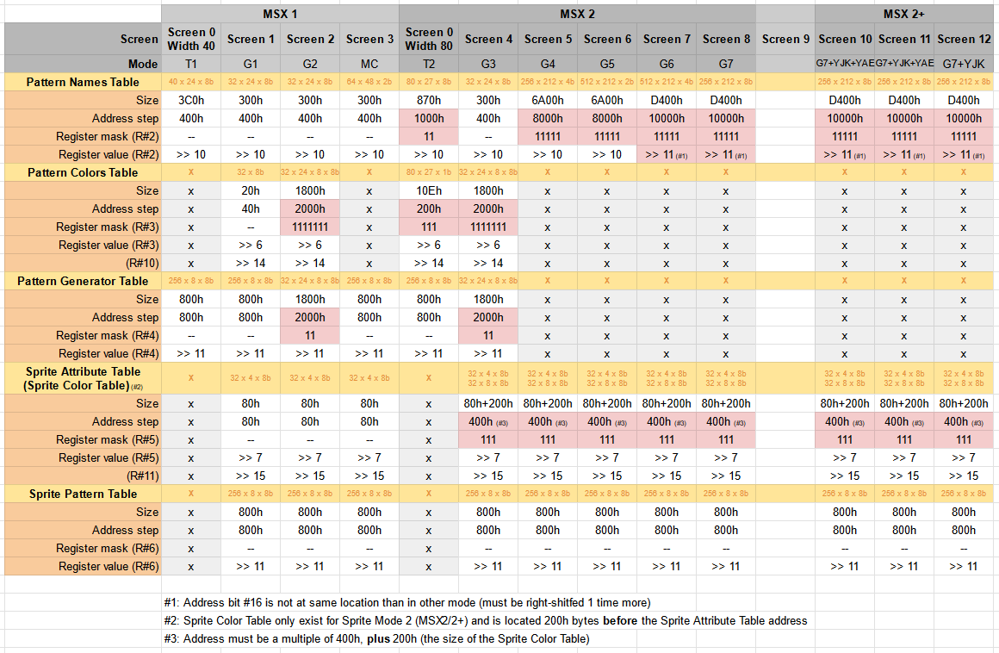

TMS9xxx Video Chips and Compatibles
===================================

References:
- [Sony HB-10P/10B Service Manual][hb10sm], P.39. Pinouts of TMS and T6960.
- MSX.org Wiki, [Toshiba T6950][mw-t6950]

TMS9xxx Design
--------------

The output resolution is 256×192, with 15 unique colours plus transparent.
The display has 35 planes which are, Bottom to top, external VDP, backdrop,
pattern plane, and sprite planes 31 through 0.

Many modes set the pattern plane as table of _patterns_ (characters). This
uses the following tables:
- __Pattern Name Table__ (32×24 = 768 bytes in Graphics mode; 40×24 = 960
  bytes in Text mode; aligned to 1024 byte boundary). Each entry references
  an 8×8 (Graphics mode) or 6×8 (Text mode) entry in the Pattern Generator
  Table; the upper 5 bits also index into the Color Table.
- __Pattern Generator Table__ (256 entries × 8 bytes = 2048 bytes; aligned
  to 2048 byte boundary). Each entry is the a row in the bit pattern, with
  TI bit 0 (standard bit 7) at left. The upper 5 bits determine the entry
  from the Color Table.
- __Color Table__ (32 entries × 1 byte). Each entry MS nybble defines the
  colour for 1 bits in the PGT and each LS nybble defines colours for the 0
  bits. Entry 0 is used for patterns 0-7, entry 1 for patterns 8-15, etc.

Tables Summary:
 <!--  1160 x 758 -->
(Source: aoineko, MSXGL author.)

TMS9xxx Pinouts
---------------

Adapted from a [TI list server post][tilist] excerpting the
"TMS9118/TMS9128/TMS9129 Data Manual":

The 9118/9128/9129 VDP's are the succesors of the 9918A/9928A/9929A VDP's.
These new chips have improved memory addressing circutry which allows the
interface of either 8 TMS4116 (2k) or 2 TMS4416 (8K) dynamic RAMs.

                                    VDP PROCESSOR TYPE
          ┌───U───┐
      RAS ┤1    40├ XTAL1      9118     9128/29  9918A    9928A/29A
      CAS ┤2    39├ XTAL2      =======  =======  =======  =========
      AD7 ┤3    38├ ......     CPUCLK   R-Y      CPUCLK   R-Y
      AD6 ┤4    37├ ......     NC       CPUCLK   GROMCLK  GROMCLK
      AD5 ┤5    36├ ......     COMVID   Y        COMVID   Y
      AD4 ┤6    35├ ......     EXTVDP   B-Y      EXTVDP   B-Y
      AD3 ┤7    34├ RESET/SYNC
      AD2 ┤8    33├ vCC
      AD1 ┤9    32├ RD0
      AD0 ┤10   31├ RD1
      R/W ┤11   30├ RD2
      vSS ┤12   29├ RD3
     MODE ┤13   28├ RD4
      CSW ┤14   27├ RD5
      CSR ┤15   26├ RD6
      INT ┤16   25├ RD7
      CD7 ┤17   24├ CD0
      CD6 ┤18   23├ CD1
      CD5 ┤19   22├ CD2
      CD4 ┤20   21├ CD3
          └───────┘

VRAM pins:
- `AD0` (MSB) … `AD7` (LSB): out, VRAM address bus
- `RD0` (MSB) … `RD7` (LSB): I/O, VRAM data bus
- `CAS`: out, VRAM column address strobe
- `RAS`: out, VRAM row address strobe
- `R/W`: out, VRAM write strobe

System bus pins:
- `CD0` (MSB) … `CD7` (LSB): I/O, CPU data bus
- `CSR`: in, CPU-VDP read strobe
- `CSW`: in, CPU-VDP write strobe
- `INT`: out, CPU interrupt output
- `MODE` in, CPU interface mode select (address line or select)

Other pins:

      SIGNATURE PIN I/O DESCRIPTION
      ========= === === ======================================================
     RESET/SYNC 34   I  Trilevel input; below 0.8v - initalizes the VDP
                        above 9v sync - sync input for EXTVDP
           vCC  33   I  +5v supply
           vSS  12   I  Ground reference
         XTAL1  40   I  10.738635 MHz crystal connection
         XTAL2  39   I  10.738635 MHz crystal connection

9918/28/29 Differing Pins:

    SIGNATURE   PIN I/O DESCRIPTION
    =========== === === =====================================================
    EXTVDP       35  I   Multiple TMS9118 VDP operation
    B-Y          35  O   Blue color difference output

    COMVID       36  O   Composite Video Output
    Y            36  O   Y (Black/White luminance and composite sync) output

    NC           37      Reserved - Do not use
    CPUCLK       37  O   CPUCLK equals XTAL/3 (color burst freq)

    CPUCLK       38  O   CPUCLK equals XTAL/3 (color burst freq)
                         Can be used as an external clock
    R-Y          38  O   Red color difference output

Toshiba T6960
-------------

Software-compatible chip, but:
- different pinout in 42-pin DIP.
- 2× clock rate?
- Both NTSC and PAL available; pin 36 `NTSC/P̅A̅L̅`determines which.

Pinout:

                          ┌───U───┐
                      R̅A̅S̅ ┤1    42├ HCLK 1    half clock
                      C̅A̅S̅ ┤2    41├ HCLK 2
                    R̅E̅S̅E̅T̅ ┤3    40├ XTAL 1
           MSB        AD0 ┤4    39├ XTAL 2
                      AD1 ┤5    38├ TEST
                      AD2 ┤6    37├ COMVID    composite video out
                      AD3 ┤7    36├ NTSC/P̅A̅L̅
                      AD4 ┤8    35├ O̅E̅
                      AD5 ┤9    34├ Vdd       +5V
                      AD6 ┤10   33├ RD7       MSB
           LSB        AD7 ┤11   32├ RD6
                       W̅E̅ ┤12   31├ RD5
                      GND ┤13   30├ RD4
                     V̅R̅/̅W̅ ┤14   29├ RD3
                      C̅S̅W̅ ┤15   28├ RD2
                      C̅S̅R̅ ┤16   27├ RD1
                      I̅N̅T̅ ┤17   26├ RD0       LSB
           LSB        CD0 ┤18   25├ CD7       MSB
                      CD1 ┤19   24├ CD6
                      CD2 ┤20   23├ CD5
                      CD3 ┤21   22├ CD4
                          └───────┘

MSX2 Series
-----------

64-pin shrink-DIP; approx same size as DIP-40W.

- V9938 (YM2701): 512×212 (424i) 16/512 colors; 256×212 (424i) 256 colors.
- V9958 (YM2703):YJK mode, Amiga-HAM-like 19,268 colors

<!-------------------------------------------------------------------->
[hb10sm]: https://archive.org/details/sonyhb10p10bsm/page/n38/mode/1up
[mw-t6950]: https://www.msx.org/wiki/Toshiba_T6950
[tilist]: https://groups.google.com/g/comp.sys.ti/c/2qFvxOoWj9A/m/PHboGi6lyOwJ?hl=en
