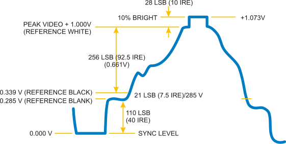
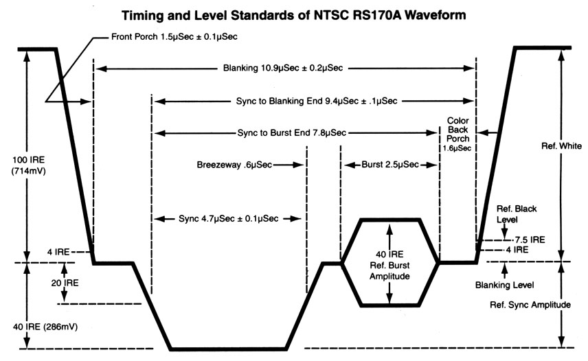

Video on 8-bit Systems
======================

For connector information, see [conn/video](conn/video.md).

Video output is generally vertical sync for ~50-60 Hz frames or fields (two
interlaced fields per frame), horizontal synchronization signals for 260 or
more lines per frame/field, and image information encoded as a single (Y)
or three (RGB) luminance signals and, for non-RGB color systems,
additional encoded color information as either one or more separate signals
(chroma for S-video; Cb and Cr for component video) or combined with the
luma signal (CVBS/composite color video).

Separate sync signals are typically TTL; Luminance (B/W or RGB) signals are
TTL in digital/DRGB systems (8 colors, or 16 with an additional intensity
signal) or about a volt into 75Ω in analogue systems. The original
[RS-170][epanorama] standard specified levels into 75Ω of 1.4 V P-P: -0.400
V sync, 0 V blank (reference), +0.075 V black, and +1.000 V white +1.000.
But more frequently in modern systems it's scaled to 1.0 V P-P. CVBS
standard levels (from [[wp cvbslev]]) and NTSC timings (from [Beale
Corner][bc trv900] via [Modular Circuits][mc zx81]):

 <!-- 561 × 284 -->
 <!-- 856 × 526-->

Systems for color or monochrome video with various degrees of multiplexing
(not specifying any particular sync rates or interlace) are, roughly:

- RGBHV: Three luminance signals and separate H and V sync signals
- RGBS: Composite (H+V) sync signal
- RGB: Sync on green (or sync unspecified)
- DRGB: 8-color digital RGB, usually TTL, and usually separate H and V sync.
- DRGBI: 16-color digital RGB with fourth "intensity" value.
- Component video: Y+sync Pr Pb (Y Cr Cb is the digital format)
- Y/C: Y+sync, chroma. Also "S-video," which has multiple meanings.
- CVBS (color video baseband signal): Y+sync+color, using one of several
  broadast systems (NTSC, PAL, etc.) to encode the color information.
- MVBS (monochrome video baseband signal): Y+sync

"Digital" monitors often cannot accept an analogue luminance signal, but
on monochrome monitors (and maybe even color?) you can get gray scale
by instead using PWM to reduce the "on time" of a pixel, thus making it
less bright. See e.g. [New Tricks for an old PET][f6 82495].

#### DRGBI and IBM 5153 "Brown"

Converting DRGB to analogue RGB is almost invariably done in the simplest
way: each color input produces a fixed "full" intensity color output set so
that when RGB=111 the output is white.

DRGBI is the same when I=1, but when I=0 the level of intensity reduction
is an arbitrary design choice and, unlike I=1, it is also under manual
control via the display's contrast setting. (For this reason, testing is
often done with contrast turned up to maximum.)

Particular implementations can get even more complex; the IBM 5153 (CGA)
display detects RGBI=1100 (low-intensity yellow) and reduces the amplitude
of the green signal a little bit extra (about 0.64 of red) to give a more
brown color. It also increases the "off" level of all of RGB when I is set
(RI=00,01,10,11 → 0.00,0.40,1.00,1.12 V) and, due to the implementation,
more colors set with I gives a higher output for all set colors
(RGBI=1001 → 1.12 V, RGBI=1101 → 1.24 V, RGBI=1111 → 1.30 V). Full details
are given in [[Holden2016]], and there's further discussion at
[[vcfed 1234458]].

Note that the CVBS output of the CGA card is rather different and does not
produce the same 16 colors as the IBM 5153. The [IBM 5154][] (EGA) monitor
also accepted a CGA input signal but did the DRGBI → analogue RGB
conversion quite differently and so also does not produce quite the same
set of 16 colors. (It maps the 16 DRGBI colors to a subset of the 64 EGA
RrGgBb colors, using "bright red + dark green" for brown, as documented in
the table on p.4 of [the manual][mzd-ega]. ([source][mzd]))

#### CVBS Standards

Notes:
- The 1953 NTSC color encoding (as opposed to 1941 NTSC image encoding) and
  PAL are color encoding standards that are not technically tied to
  luminance image broadcast standards (typically 625 and 525 lines).
- Technically "CCIR System" standards are for broadcast, and include RF
  frequency assignments as well as video encoding.
- See [[epanorama]] for some further details on video signal standards not
  modulated on RF for broadcast.

Standards:
- CCIR System A: (376i50) 405-line 25 FPS interlaced 10.125 kHz. Britian
  (1937-1969 on BBC1; BBC2 was System B from start in 1964), Ireland
- CCIR System M: RS-170 or NTSC with North American RF assignments.
- CCIR System J: System M w/different RF channel assignments (?). Japan.
- CCIR monochrome video format:
- PAL-M: System M with PAL color. Brazil.
- RS-170 (1941 NTSC; "EIA"): 525-line 30 FPS interlaced 15.750 kHz B/W.
  Image 512 lines (?) with 485 displayable.
- RS-170A / NTSC-M (1953 NTSC): (480i60) 525-line
  30/1.001 ≈ 29.970 FPS interlaced. 15.734 kHz color.
  Backward-compatible w/RC-170.
- CCIR System B: (576i50) 625-line 25 FPS interlaced 15.625 kHz B/W,
  European (and later British). Used with both PAL (4.43361875 Mhz) and
  SECAM color.

#### NTSC Color Encoding

C is a 5×7×9/(8×11) Mhz = 315/88 Mhz ~= 3.579545 MHz ±10 Hz signal added to
Y (2nd order amplitude modulation). The color burst is a burst of this at
0° in the back porch to give the 0° phase reference. [phirenz]
- Luminance: average value of Y, but see below.
- Saturation (I): amplitude of 3.58 MHz waveform added to Y: ±0.07 V = 100%.
  See below about separating this from luminance. This may show as "chroma
  dots" on old B/W sets that don't do this separation. (Newer B/W sets are
  supposed to filter when a color burst is present.)
- Hue (Q): phase of 3.58 MHz waveform: 0°=blue, 100°=red, 178°=yellow.

Older TVs used a notch filter (2.8 - 4.1 MHz) to extract C, leaving Y as
0 - 2.8 Mhz and 4.1 - ~5.5 Mhz. Thus alternating vertical bars at a width
that would produce a frequency in the notch range will be interpreted as
color if a color burst is present in the back porch. The notch range is
approximately 188 TV lines per sweep. Modern TVs use comb filters that do a
much better job. [an9644] has some excellent image examples and details on
filtering.

#### Vertical Sync

When identifying a video format, both [ITU BT.601] and [SMPTE 259M] append
the field rate directly to the format or the frame rate with a slash,
making "480i60" and "480i/30" the same thing.

Standard vertical field rates are almost invariably around 50-60 Hz, with a
frame rate half that because the output is interlaced. The SD vsync signal
goes low (-300 mV from black level) with the line 4 hsync pulse and returns
to high (black level) with the line 7 hsync pulse (falling edge). [[hdr
csync1]]

Odd-line (1,3,…) fields are indicated by starting vsync with hsync;
even-line (2,4,…) fields by starting and ending vsync half-way between two
hsync pulses (after hsync 266 and hsync 269 of the frame), thus giving
262.5 lines per field in NTSC video. See the [LMH1981] datasheet and
[[hdr csync1]] for sample waveforms, and [[pcbj-gen]] for sync generation
notes.

The standard sytems also actually originate a composite sync that uses
equalization pulses around and during vsync; see "Composite Sync" below for
more information on this.

Many systems do a (non-standard as far as TV goes) progressive 262 or 263
line 60 FPS display (240p) by always starting vsync on a line boundary.
(This may leave "blank" scan lines between the rendered scan lines on the
monitor.) This also affects csync; see below. It seems that most CRT
monitors/TVs handle this, but many non-CRT monitors and digital capture
devices may not. Additionally, some devices may handle it correctly through
composite but not component inputs, and vice versa. [[hdr 240]] The [240p
test suite][240p ts] may be useful when analyzing 240p output and how
upscalers deal with it.

#### Horizontal Sync

Horizontal sync rates start around 15.7 kHz for ~200 displayed lines (see
progressive note below), and are increased when displaying more lines in
progressive signals. Common horizontal sync rates (kHz) are:

     480i   15.750    NTSC B/W: 262.5 lines × 2 × 60 Hz fields
     480i   15.734    NTSC color: as B/W at 59.940 Hz
     576i   15.625    PAL: 312.5 lines × 2 × 50 Hz fields
            21.8      EGA (350 line)
           ~24        400-line modes
            31.469    VGA

SD uses bi-level sync, with the leading edge of the horizontal sync pulse
(-300 mV from black level) indicating the start of the line. The pulse is
typically around 4.7 μs, but the trailing edge should be ignored. HD uses
tri-level sync going to -300 mV then +300 mV before returning to black
level; the sync reference point is the zero-crossing between the two. Some
cheaper HD systems will use the rising edge of SD sync too, causing
problems. Others always use the first falling edge. [[hdr jit]]

An individual line consists of _front porch_ before the sync, sync, _back
porch_ (which is used to set 300 mV black level and may include color
burst), and displayed data. See [Structure of a video signal][wp hline].
The displayed data may include a border before and after reading from a
frame buffer.

#### Composite Sync (csync)

Combining the sync signals produces composite sync (csync). Suppressing the
hsync during the vsync pulse would cause loss of horizontal sync during the
vertical sync interval; the solution is to return to black level for a
short period _before_ the falling edge of the hsync signal so that a
falling edge is still present at the right point, called _serrated pulses_
within the _broad pulses_ of the vsync. This is _not_ the same as doing an
XOR of the signals [[hdr csync2]]; that would delay the falling edge of
hsync by the hsync signal width; properly constructed csync retains exactly
the hsync's falling edges. [[hdr csync1]]

But because the signals are interlaced, it's even trickier because it
introduces a falling edge half-way between the two horizontal sync signals.
This is fixed in the NTSC standards by introducing double-rate and narrower
"equalization pulses" for the three lines before, three lines during and
three lines after the vsync interval; effectively it looks like the hsync
runs at double rate with a narrower pulse during this time. This is
typically decoded with a one-shot (monostable multivibrator) to recover the
hsync and an integrator (low-pass filter) to recover the vsync. [[hdr
csync1]].

Nonstandard progressive SD video (240p) often drops the equalization pulses
and may also use standard-width hsync pulses during vsync. Being
non-standard, there are many variations of what exactly goes on here. [[hdr
csync2]] describes various methods of combining sync and what kind of
variations they produce:
- AND gate: suppresses hsync during vsync. CRTs usually recover sync within
  the first few lines (often the non-displayed lines). More modern systems
  using a digital PLL may lose the signal completely unless it has good
  "coast" functionality.
- XNOR: delays hsync per first paragraph above. Digital PLLs may or may not
  have a range wide enough to capture the shifted falling edges. XNOR may
  generate glitches when both inputs change at the same time (sometimes
  fixed with an RC filter).

[[TB476]] discusss how to try to recover from poor csync implementations.

#### Input Conditioning

The [LMH1981] datasheet discusses input AC coupling considerations for
video (p. 14) and suggests 1 μF for DC-coupled inputs and 0.01 μF for
AC-coupled inputs.

The [LM1881] datasheet notes that for a 75 Ω input, 620 Ω in series with
the source and 510 pF to ground will form a lowpass with a corner of 500
kHz, easily passing the sync but reducing subcarrier by almost 18 dB,
though delaying the output of the LM1881 by 40-200 ns.

For converting TTL sync to video-level, RetroRGB suggests using a 470R (or
sometimes 330R) in series, creating a voltage divider of 0.13 (0.18) with
the 75Ω input impedence.

Circuits
--------

- [SPI EEPROM generating sync][f6 76975]. Ingenious Dr. Jefyll design; 2×
  serial EEPROM and one 74HC164.
- [PentaVeega][pv] generates 8-color VGA from a 6-pin ATtiny5, using some
  clever tricks with tri-state outputs and the monitor's 75Ω termination as
  part of a voltage divider. Schematic in [`hardware/pentaveega_v1.pdf`][pvs].

Common Resolutions and Timings
------------------------------

Individual timings are given as _i/t_, where _i_ is the number of dots or
lines and _t_ is the (approximate) time. Line or frame time sets are given
as groups of individual timings: total, front porch, sync, back porch and
optionally displayed data, which may include the border or be broken down
into _sb+dd+eb_ for start border, (user) display data and end border.

    dotclk MHz  Resolution  Name [source]
    hfreq  kHz      dots/μs      front       sync      back
    vfreq   Hz      lines/ms     front       sync      back
    ───────────────────────────────────────────────────────────────────
    14.3183     640×200     PC88 15.7 kHz [measured]
    15.9           /62.80
    61.4           /16.28

    14.3183     640×400     PC88 24.8 kHz [measured]
    25.0           /40.00
    56.3           /17.76

    14.31818    640×200     PC98 "15 kHz" [tim pc98]
    15.98       896/62.58    64/4.47    64/4.47  128/8.94
    61.23       261/16.33    15/0.94     8/0.50   38/2.38

    21.0526     640×400     PC98 "24 kHz" [tim pc98]
    24.83       848/40.28    64/3.04    64/3.04   80/3.8
    56.42       440/17.72     7/0.28     8/0.32   25/1.01

    25.175      640×400     PC98 "31 kHz" [tim pc98]
    31.47       800/31.78    14/0.58    64/2.54  82/3.24
    70.05       449/14.28    13/0.41     2/0.064 35/1.09

Fujitsu FM-7:
- Hsync: 4 μs wide (no change around vsync).
- Vsync: 2.4 μs before hsync, 506 μs wide.  
  Covers 8 hsync pulses, including the one that starts just after vsync.
- CVBS: XOR sync. No equalization pulses.  
  No color burst. Colors produce eight equally-spaced luminance steps.
- RGB: Vpp = 6.8 V into MΩ, 2.1 V into 75Ω (one chan. only).  
  Series resistor into PVM (Ω=V) and comparsion of white with composite:
  - 820=0.46    noticably dimmer, gray not white
  - 680=0.46    as 820 (???)
  - 470=0.56    a bit dimmer, near monochrome gray 1 below white
  - 330=0.66    slightly brighter
  - 75=0.90     much brighter
- Measurement notes:
  - Vpp above is actually Vampl measurement from the scope, due to heavy
    ringing on the RGB lines.
  - There were a lot of consistency problems with the series resistor
    tests. Possibly the voltage changes when not using the same resistor on
    all three outputs.

National/Panasonic JR-200:
- Horizontal (in CVBS): 63.6 μs; ?/5.5 ?/4.5 ?/9 ?/44.7.
  No change around vsync.
- Vertical (in CVBS): 264?/16.32 5/318 3/191, 24/1526, 24+192+16/?
  - Vsync leading edge is synchronous with hsync.
  - Covers 3 hsync pulses, counting the end rise as hsync too.
- CVBS: XOR sync. No equalization pulses. No color burst during vsync.
- RGB: Vpp = 4 V into MΩ, .65 V into 75Ω (one chan. only).  
  Series resistor into PVM (Ω=V) and comparsion with composite output:
  - 470=0.46    brighter, but composite white was gray, and yellow was orange.
  - 680=0.46    same as 470!?
  - 820=0.40    R,G,B dimmer; white still brighter (not gray)
  - 330=0.68    W,G brighter; red similar, blue dimmer

Apple IIc:
- Horizontal (in CVBS): 63.6 μs: `_/7.5 _/3.9 _/13.2 _/39.0`
- Vertical (in CVBS): 262 lines; `32/_ 4/_ 34/_ 192/_`
  - hsync on falling edge during vblank; not XOR
- CVBS:
  - Color burst during vsync

PET (built-in monitor; luma switches on/off around 2.5 V):
- Explanation, schematics and some timings from [Andre][pet andre].
- [PET CRTC] spreadsheet.
- Further info and mods in [this thread][pet f6 623]. Includes support for
  double horizontal scan rate (40 kHz instead of 20 kHz lines @60 Hz) for
  higher resolution.

Macintosh "built-in" 512×342 b/w video (128K, 512K, Plus, SE, SE/30):
- Pixel clock: 15.6672 Mhz (~ 0.064 μs/pixel)
- Horizontal: 22.25 kHz 44.93 μs; `192/12.25 (front/sync/back) 512/32.68`
- Vertical: 60.15 Hz 16.6258 ms; `28/1258.17 (all vert blank) 342/15367.65`
- All 74xx logic.
- [_Macintosh Hardware Guide_][machwg] pp. 399-403 and [Mac 128K/512K
  Computer Technical Information][mac128tech] pp. 6-8 for timings, buffers
  and vblank handling.

#### References

- [[tim opt]] Classic Console Upscaler Wiki, ["Optimal timings"][tim opt].
  Timings for many consoles and a few computers from NES through Wii.
- [[tim NES]] Nes Dev Wiki, ["NTSC Video"][tim nes]. Detailed Nintendo
  Entertainment System/Famicom timings and C++ code for emulation.
- [Technical details of Display out [PC98]][tim pc98]. Waveforms and timing
  details for 15/24/31 kHz modes.

References
----------

Datasheets and Application Notes:
- Maxim APP 734 [Video Basics][man734]. Fundementals of analog video.
  Good glossary but little detail.
- TI [LM1881] Video Sync Separator. Classic chip to extract csync, vsync
  odd/even and burst/back porch from a composite video signal. Includes
  info on filtering color information from composite video.
- TI [LMH1981] Multi-Format Video Sync Separator. Includes waveforms for
  various SD and HD video and sync signals.
- Analog Devices [ADV7170] Digital PAL/NTSC Video Encoder. Provides lots of
  insight into how to generate video signals.
- Renesas, Technical Brief \[TB476] [Regenerating HSYNC from Corrupted SOG
  or CSYNC during VSYNC][TB476]. (SOG = Sync On Green.) Includes schematic
  and board layout for sync regeneration device that "cleans up" the sync
  for cheap digital monitors.
- Renesas [ISL4089] DC-Restored Video Amplifier. Used in [[TB476]] to
  remove sync from green signal.

HD Retrovision articles and posts:
- \[hdr csync1] [Engineering CSYNC - Part 1: Setting the Stage][hdr csync1]
- \[hdr csync2] [Engineering CSYNC - Part 2: “Falling” Short][hdr csync2]
- \[hdr jit] [Sync Jitter][hdr jit]
- \[hdr 240] [More information than you need about “240p” video][hdr 240].

Other sources
- \[scanlines] [Scanlines Demystified / Special Downscaling Edition
  Q&A][scanlines]. Extensive 240p discussion and pics; equipment
  information.
- \[240p ts] Classic Console Upsaker wiki, [240p test suite][240p ts].
- \[pcbj-gen] pcbjunkie.net, ["Generating Video with a
  Microcontroller"][pcbj-gen].

Sample circuits and programming:
- \[c64-80] [The Commodore 64 80-Column Terminal][c64-80], Field, Richards
  and Beenfeldt, _BYTE_ March 1985, p.183. Quite generic Motorola 6845
  80-column CVBS display system; bus interface to the C64 cartridge port.
- \[pc6001vid4] [PC-6001 SCREEN MODE4 の色滲みを調べる][pc6001vid4].
  Detailed explanation of NTSC color, the Motorola 6847, and how the
  PC-6001 produces colour in a black-and-white mode using artifacts.

<!-------------------------------------------------------------------->

[Holden2016]: https://www.worldphaco.com/uploads/FITTING_AN_EGA_CARD_TO_AN_IBM_5155.pdf
[IBM 5154]: https://www.ibm.com/common/ssi/ShowDoc.wss?docURL=/common/ssi/rep_ca/3/897/ENUS184-113/index.html
[an9644]: https://www.renesas.com/jp/en/document/apn/an9644-composite-video-separation-techniques
[f6 82495]: http://forum.6502.org/viewtopic.php?f=4&t=6238#p82495
[mzd-ega]: http://minuszerodegrees.net/oa/OA%20-%20IBM%20Enhanced%20Color%20Display%20(5154).pdf
[mzd]: http://minuszerodegrees.net/oa/oa.htm
[phirenz]: https://www.youtube.com/watch?v=3JFt6t6ijLs&lc=UgxaSs9KAeuIR-tCWJ54AaABAg
[vcfed 1234458]: https://forum.vcfed.org/index.php?threads/representing-ibm-5153-color-output-more-accurately.1234458/

<!-- Circuits -->
[pv]: https://bitbucket.org/jartza/pentaveega/
[pvs]: https://bitbucket.org/jartza/pentaveega/raw/2752ce4ea366d7cf59fe165aef9c6175a3016da9/hardware/pentaveega_v1.pdf
[f6 76975]: http://forum.6502.org/viewtopic.php?p=76975#p76975

<!-- Common resolutions and timings -->
[mac128tech]: https://archive.org/details/Mac_Hardware_Info_Mac_128K/page/n4/mode/1up
[machwg]: https://archive.org/details/Guide_to_the_Macintosh_Family_Hardware_Second_Edition/page/n437/mode/1up
[tim NES]: http://wiki.nesdev.com/w/index.php/NTSC_video
[tim opt]: http://junkerhq.net/xrgb/index.php?title=Optimal_timings
[tim pc98]: https://radioc.web.fc2.com/column/pc98bas/pc98dispout2_en.htm

<!-- References -->
[240p ts]: http://junkerhq.net/xrgb/index.php?title=240p_test_suite
[ISL4089]: https://www.renesas.com/jp/ja/www/doc/datasheet/isl4089.pdf
[ITU BT.601]: https://en.wikipedia.org/wiki/Rec._601
[LM1881]: https://www.ti.com/lit/ds/symlink/lm1881.pdf
[LMH1981]: https://www.ti.com/lit/ds/symlink/lmh1981.pdf
[SMPTE 259M]: https://en.wikipedia.org/wiki/SMPTE_259M
[TB476]: https://www.renesas.com/us/en/www/doc/tech-brief/tb476.pdf
[adv7170]: https://www.analog.com/media/en/technical-documentation/data-sheets/ADV7170_7171.pdf
[bc trv900]: http://bealecorner.com/trv900/tech/
[c64-80]: https://archive.org/details/byte-magazine-1985-03-rescan/page/n188/mode/1up
[epanorama]: https://www.epanorama.net/documents/video/rs170.html
[hdr 240]: https://www.hdretrovision.com/240p
[hdr csync1]: https://www.hdretrovision.com/blog/2018/10/22/engineering-csync-part-1-setting-the-stage
[hdr csync2]: https://www.hdretrovision.com/blog/2019/10/10/engineering-csync-part-2-falling-short
[hdr jit]: https://www.hdretrovision.com/jitter
[man734]: https://pdfserv.maximintegrated.com/en/an/AN734.pdf
[mc zx81]: https://www.modularcircuits.com/blog/projects/the-dinosaur-computer/
[pc6001vid4]: http://p6ers.net/mm/pc-6001/dev/screen4color/
[pcbj-gen]: http://pcbjunkie.net/index.php/guides/generating-video-with-a-microcontroller/
[pet andre]: http://6502.org/users/andre/petindex/crtc.html
[pet f6 623]: http://forum.6502.org/viewtopic.php?f=1&t=6231
[pet_crtc]: http://inchocks.co.uk/commodore/PET/PET_CRTC.xls
[scanlines]: http://scanlines.hazard-city.de/
[wp cvbslev]: https://en.wikipedia.org/wiki/Composite_video#Signal_components
[wp hline]: https://en.wikipedia.org/wiki/Analog_television#Structure_of_a_video_signal
