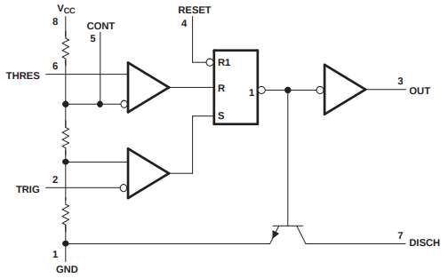
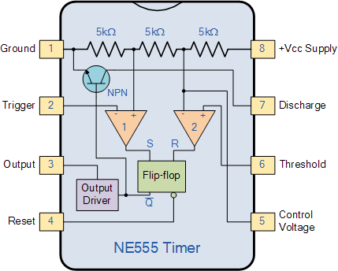
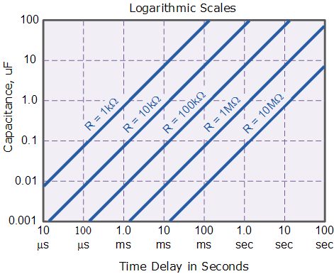

555 Timer Notes
===============

### Pinout

     556   555  Name   Description
      7     1   GND
    6   8   2   TRIG   trigger sets output when pulsed < ⅓ Vcc
    5   9   3   OUT    output of flip-flop; source/sink 200 mA @ Vcc-1.5V
    4  10   4   R̅E̅S̅E̅T̅  active-low, resets output (unused: → Vcc)
    3  11   5   CONT   control voltage overrides internal ⅔ Vcc level (unused: →10nF→GND)
    2  12   6   THRES  threshold resets output when > ⅔ Vcc
    1  13   7   DISCH  short to GND when output low (don't connect to Vcc!)
     14     8   Vcc    4.5 - 15 V

### Internal Diagrams

The block diagram below right does not indicate that the output driver
inverts the input from the flip-flop.

<nbsp/>
<nbsp/>

### Theory of Operation

The core of 555 circuits is that a low pulse on TRIG not only sets the
flip-flop (driving the output high) but also disconnects DISCH from
ground, allowing an external pull-up to start charging a timing
capacitor. The + side of the cap is generally connected to THRESH to
reset the flip-flop when the cap has charged to ⅔ Vcc.

Minimum input pulse on TRIG is about 10 μs to reliably trigger. (This
also means that the minimum output pulse is the same.)

The output can both source and sink current. [etws] says 200 mA @
Vcc-1.5V; [ti] says it increases with Vcc. The output may not always
rise to the rail; I've seen pull-ups used on it.

Circuits
--------

### Monostable Multivibrator (One-shot) Mode

Triggering:
- By input pulse (minimum 10 μs) falling below trigger threshold.
- Additional input pulses during the timing cycle (output pulse
  length) will not retrigger.
- Input pulse longer than output pulse will extend output pulse.

Schematic:

    Vcc         DISCH ┬ THRES         GND
     ├───── R₁ ───────┴─────── C₁ ─────┤    Timing: t ≅ 1.1 × R₁ × C₁
     │                                 │
     │              TRIG               │
     ├───── R₂ ───────┼──── switch ────┤    Pull-up on input; ground to trigger
     │                └────── C₂ ──────┤    Optional switch debounce
     │                                 │
     └── R ── led ── OUT ── led ── R ──┤    Sample ouptut for visualization
                            RESET ─────┤    Unused
                       CONT ── 10 nF ──┘    Unused

Timing nomograph:

### Bistable Mode

Pull down threshold; pull up trigger and reset. Low pulse on
trigger/reset switches output high/low. Use? (Doesn't look like it can
debounce.)

### Schmitt Trigger Inverter

See [[wp]]. Not studied yet. Leaves DISCH unconnected.

References
----------

- \[ti] [xx555 Precision Timers][ti] datasheet, Texas Instruments.
- \[wp] [555 timer IC][wp], Wikipedia.
- \[etws] [555 Timer Tutorial][etws], electronics-tutorials.ws.
  Has an excellent internal diagram.
- \[etws-osc] [555 Oscillator Tutorial][etws-osc], electronics-tutorials.ws.
  Has an excellent internal diagram.
- \[dum] [555 Timer Chip in Monostable (One-Shot) Mode][dum], dummies.com.
- \[555circ] [555 Timer Circuits][555circ] website.

<!-------------------------------------------------------------------->
[555circ]: http://www.555-timer-circuits.com/
[dum]: https://www.dummies.com/programming/electronics/components/electronics-components-555-timer-chip-in-monostable-one-shot-mode/
[etws-osc]: https://www.electronics-tutorials.ws/waveforms/555_oscillator.html
[etws]: https://www.electronics-tutorials.ws/waveforms/555_timer.html
[ti]: https://www.ti.com/lit/ds/symlink/ne555.pdf
[wp]: https://en.wikipedia.org/wiki/555_timer_IC
