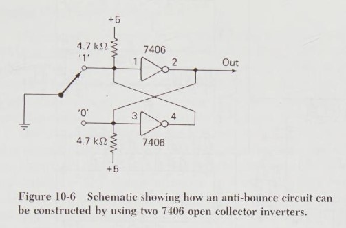

Switch Input Debouncing
=======================

For a description of the problem (and tests demonstrating it), see Jack
Ganssle, ["A Guide to Debouncing, or, How to Debounce a Contact in Two Easy
Pages"][gan1].

R/C and Schmitt-trigger
-----------------------

From [Jack Ganssle's article, part 2][gan2]:

The R/C network ensures that the voltage changes are small if the switch
bounces while the circuit charges up or down. The Schmitt-trigger gate
(e.g., [SN74LS14]) will bounce on large voltage changes, but prevents small
small voltage changes from bouncing.

The diode is not always used, but with it the R/C network will charge
faster when the switch is open because it's charging C through just R1, not
R1 + R2.

The Hitachi Basic Master Jr. uses this for the BREAK key (used for NMI and
RESET). C110=0.1μF, R1=R16=?, R2=R107=?. The gate is an HD74LS04P.

74x123 Pulse Generator
----------------------

The Altair 8800 debounces front panel momentary switches with 1/2
74x123 (dual retrigggerable monostable multivibrator); schematic on
p.24 of [Theory of Operation][a88theo]. Below, pin numbers in
subscript prefix pin function.

- Examine line ₁1A (active-low), held high w/1KΩ pull up; switch
  shorts to ground via the S̅T̅O̅P̅ signal from the RUN/STOP flip-flop
  when in stop mode.
- ₂1B (active-high), ₃C̅L̅R̅ connected to ₁₆Vcc.
- 0.1 μF between ₁₄Rext and ₁₅Rext/Cext, 47 KΩ between ₁₅Rext/Cext and ₁₆Vcc.
- Ouput is ₁₃1Q, inverted ₄1Q̅ unused.

7406 Debouncer
--------------

Note that you can get inverted output from the other gate.

From James W. Coffron, _Getting Started with 8080, 8085, Z80, and 6800
Microprocessor Systems,_ 1981, Prentice Hall. [pp.285-287][coff-286].

S/R Flip-flop
-------------

Can be used for "break before make" dual-pole switches, as [described
here][le5.2].

<!-------------------------------------------------------------------->
[SN74LS14]: http://www.ti.com/lit/gpn/sn74ls14
[a88theo]: http://chiclassiccomp.org/docs/content/computing/MITS/MITS_Altair8800TheoryOperation_1975.pdf
[coff-286]: https://archive.org/details/gettingstartedwi0000coff/page/286/mode/1up?view=theater
[gan1]: http://www.ganssle.com/debouncing.htm
[gan2]: http://www.ganssle.com/debouncing-pt2.htm
[le5.2]: http://www.learnabout-electronics.org/Digital/dig52.php
