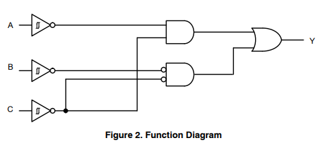

Logic Gates
-----------

The [binary truth table][binop]. `in` = number of effective inputs.

    0 0 1 1      A
    0 1 0 1  in  B
    -----------------------------------
    0 0 0 0   ₀  FALSE    0                 A∙/A, contradiction
    1 1 1 1   ₀  TRUE     1                 A+/A, tautology
    0 0 1 1   ₁  A        A                 projection
    1 1 0 0   ₁  NOTA     /A                negation
    0 1 0 1   ₁  B        B                 projection
    1 0 1 0   ₁  NOTB     /B                negation
    0 0 0 1      AND      A∙B
    1 1 1 0      NAND     /(A∙B)
    0 1 1 1      OR       A+B
    1 0 0 0      NOR      /(A+B), /A∙/B
    0 1 1 0      XOR      A⊕B, A≠B
    1 0 0 1      XNOR     A=B,              A↔B, iff, biconditional
    0 0 1 0               A∙/B
    0 1 0 0               /A∙B
    1 0 1 1               A+/B
    1 1 0 1               /A+B              A→B, implication

For a more detailed version, see [Logic Functions](sch/Logic Functions.png),
noting that the opcodes are reversed from above.

### Multiplexer as Logic Unit

A logic unit capable of all operations can be constructed from a
multiplexer ["turned sideways," where the two inputs A and B are connected
to the select lines, and the "opcode" from the left-hand columns of the
table above is placed on the 4 data inputs. The output is the result. (See
["Multiplexers: the tactical Nuke of Logic Design"][nuke], which also shows
how this technique can be used like an ROM lookup table to implement a set
of gates.)

This can also be done with three SPDT switches or relays: A input controls
a pair of F₀/F₁ and F₂/F₃ switches, those outputs feed an F₀₁/F₂₃ switch
controled by B.

    F₀ ──┤A̅     │
    F₁ ──┤A  F₀₁├────┤B̅    │
                     │     │
    F₂ ──┤A̅  F₂₃├────┤B  Fₙ├─── Y
    F₃ ──┤A     │

### Reconfigurable Logic Unit

The [NL7SZ57] is a "reconfigurable logic gate" with three inputs that, when
connected to two outputs in various ways, can implement any one of several
of the operations above.

Adders
------

### Half Adder

    0 1 0 1     A
    0 0 1 1     B
    ----------------------------
    0 0 0 1     C  carry    A∙B
    0 1 1 0     S  sum      A⊕B

#### Full Adder

    0 1 0 1  0 1 0 1  A
    0 0 1 1  0 0 1 1  B
    0 0 0 0  1 1 1 1  Carry
    --------------------------------------------------------
    0 0 0 1  0 1 1 1  C     A∙B⊕C       A∙B + C∙(A⊕B)
    0 1 1 0  1 0 0 1  S     A⊕B⊕C       C∙/(A⊕B) + /C∙(A⊕B)

* Make from two half adders:
  - A1∙B1 = S1 → A2
  - A2⊕B2 → Sum
  - Carry input → B2
  - A2∙B2 → C2
  - C1+C2 → Carry Output (short for wired-OR, assuming no backfeed)

ALUs
----

The [74181 set][74181],  [74x181] 4-bit ALU and [74x182] look-ahead carry
generator, are the "standard" bit-slice ALU components. Data can be
active-low or active-high. Pins:
- `A0…A3 B0…B3` data inputs, `Cₙ` ripple carry input
- `S0…S3` function selection inputs, `M` mode control (high disables carry)
- `F0…F3` data outputs, `Cₙ₊₄` ripple carry output
- `P` (propagate), `G` (generate) cascade outputs for carry look-ahead
- `A=B` equality output (both inputs same; open collector for wired-or)

A simple design using this is the [PISC].

A similar unit made from multiplexors and a quad XOR gate is the [roelh 4
bit TTL ALU]. The [project log][roelh log 1] gives a lot of details about
ALU design with gates, links to transistor and relay verions, using fewer
control lines, and detailed information about how a [fast carry
circuit][roelh log 2] works. The parts are mounted on 1 sq. in. DIP circuit
board (with a couple of 100 nF caps):
- 1× 74HC151 8-input multiplexer SO-16
- 4× 74HC153 Dual 4-input multiplexer SO-16
- 2× 74HC86  Quad XOR gate SO-8

<!-------------------------------------------------------------------->
[NL7SZ57]: https://www.onsemi.com/pdf/datasheet/nl7sz57-d.pdf
[binop]: https://en.wikipedia.org/wiki/Truth_table#Binary_operations
[nuke]: http://6502.org/users/dieter/a1/a1_4.htm

[74181]: https://en.wikipedia.org/wiki/74181
[74x181]: http://www.ti.com/lit/gpn/sn54ls181
[74x182]: https://web.archive.org/web/20160418004301/http://www.ti.com/lit/ds/symlink/sn74s182.pdf
[PISC]: https://www.bradrodriguez.com/papers/piscedu2.htm
[roelh 4 bit TTL ALU]: https://hackaday.io/project/160506-4-bit-ttl-alu
[roelh log 1]: https://hackaday.io/project/160506-4-bit-ttl-alu/log/151031-the-multiplexer-is-the-heart-of-the-alu
[roelh log 2]: https://hackaday.io/project/160506-4-bit-ttl-alu/log/151032-the-fast-carry-circuit
