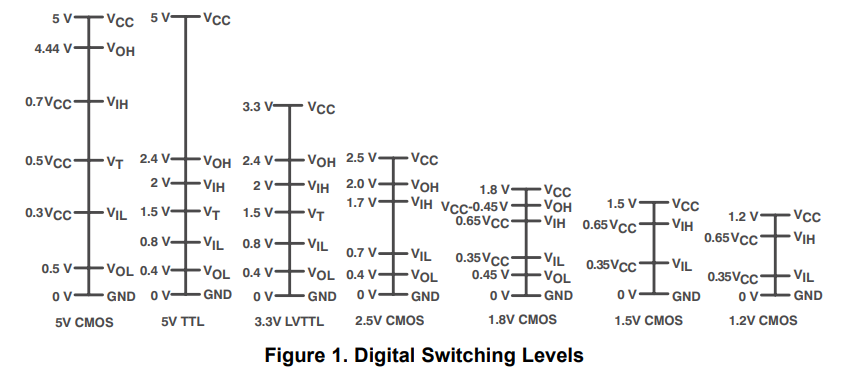
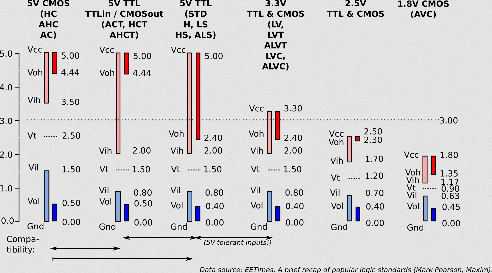

Digital Logic Levels and Families
=================================

(See [`gate`](gate.md) for logic gate theory.)

Families can refer to both general TTL vs. CMOS and specific (usually
[7400-series](7400.md) families: S-TTL, LS-TTL, ALS-TTL, HC-CMOS, etc.

Logic levels apply to all digital parts.

XXX try to sort Vcc levels (5 V, 3.3 V) from logic low/high levels
within a Vcc level.

Families
--------

- "Sub-types" on the [Wikipedia TTL page][wp-ttl] has some families.
- Interfacebus.com's [Digital Logic Information][ib-digital] page has
  lots of information on glue logic families and how to choose them.
- TI document on CMOS/HC/HCT/TTL and noise level ranges in TTL:
  [SN54/74HCT CMOS Logic Family Applications and Restrictions][ti-hct].
- LS reduced power consumption by reducing output drive and increasing
  input impedence; replacing original with LS can thus cause problems in
  heavily loaded signals such as clocks. Replacing original with HCT,
  which has more output drive (especially upward) may work.
- LS loads signal lines a lot more than HC; outputs can't pull high
  enough into some CMOS loads for them to consistently recognize HIGH
- HC is fast enough for 4 MHz; AC required for faster.
- HCT is not as efficient as HC and has worse noise margins, but still uses
  1/5 the power of LS and requires _much_ less input current (so no fanout
  restrictions).
- 74LVC1G and 74AHCT1G families (TI "litle logic," mostly single gates in
  4-8 pin "flyspeck" packages) simplify routing and have a maximum
  propagation time of ≤ 3 ns, combining these can be faster than more
  integrated ICs. (Esp. useful for building gates with wide inputs, e.g.,
  13-input NAND.) Discussion: [[any 1767]]. Docs: [[TI SCYA0409A]].

### HC over LS in Modern Systems

#### Levels

Various users on 6502.org suggest [not using LS in modern
systems][f6-t3620-2], suggesting `HC` or `HCT` instead. Obviously the
latter is TTL compatible, but [Garth Wilson has used MOS +
HC][f6-p1288] extensively, and even occsionally mixed LS with HC. Also
see later bogax post in same thread, where he also mentions that TTL
sources less current so is slower to bring up a CMOS input.

Here's a comparison of non-HC outputs to HC inputs. All HC parts use the
Vcc = 4.5 V spec. (Also see [[nes-hw-mappers]].)

                │ Fam  │ VOLmax  VILmax │ VOHmin  VOHtyp  VIHmin │
    ────────────┼──────┼────────────────┼────────────────────────┤
    MOS 6502    │ NMOS │  0.4           │  2.4      -            │
    RC65C02     │ CMOS │  0.4           │  2.4      -            │
    SN74LS138   │  LS  │  0.5           │  2.7     3.4           │
    SN74HC138   │  HC  │          1.35  │                  3.15  │

It appears that LS driving HC is not within minimum specs, but would work
if the LS chip has "typical" output specs. (per AN-368, below, "...in an
actual application the TTL output will pull-up probably to about VCC minus
2 diode voltages, and HC will accept voltages as low as 3V as a valid one
level so that in almost all cases there is no problem driving HC with
TTL.") Nonetheless, pull-ups are usually suggested.

Additional data comes from Fairchild [AN-368][fc-an-368], "An Introduction
to and Comparison of 74HCT TTL Compatible CMOS Logic" (March 1984):

                 LS Output    NMOS Output    HC Inputs    HCT Input
    Output High 2.7V  400 μA  2.4V  400 μA  3.15V  1 μA  2.0V  1 μA High Input
    Output Low  0.5V  8.0 mA  0.4V  2.0 mA  0.9V   1 μA  0.8V  1 μA Low Input

Data sheets: [[MOS 6502]], [[RC65C02]], [[SN74LS138]], [[SN74HC138]],
[[SN74HCT138]].

Fairchild [AN-319][fc-an-319] has some notes on this in the "A word
about plug-in replacement of TTL" section:

> In systems where all TTL is not being replaced and TTL outputs feed
> CMOS inputs, the input high voltages, as specified, are not totally
> compatible. Although TTL outputs will typically drive HC inputs
> correctly, an external pull-up resistor should be added to the TTL
> outputs, or an MM54HCT/MM74HCT TTL compatible circuit should be
> used. This incompatibility tends to limit the designer’s ability to
> intermingle TTL and HC-CMOS.
>
> Note, though, that HC outputs are completely compatible with the
> various TTL family’s input specifications; therefore, there is no
> problem when HC is driving TTL. Another source of possible problems
> can occur when the LS design floats device inputs. This practice is
> not recommended when using LS-TTL, but it is sometimes done.
> Usually, TTL inputs float high; however, CMOS inputs may float
> either high or low depending on the static charge on the input. It
> is therefore important to always tie unused CMOS inputs to either
> VCC or ground to avoid incorrect logic functioning.
>
> A third factor to consider when replacing any TTL logic is AC
> performance. The logic functions provided by 54HC/74HC are
> equivalent to LS-TTL, and the propagation delay, set-up and hold
> times are similar to LS. However, there are some differences in the
> way CMOS circuits are implemented which will cause differences in
> speed. For the most part, these differences are minor, but it is
> important to verify that they do not affect the design.

#### Speed

HC parts are generally about as fast or slightly faster than LS parts
(per [Garth Wilson][f6-p1288] and data sheets).

HC is fast enough for a 4 MHz system; faster than that use AC.

The high slew rates of faster parts (AS, AC, ABT) can cause problems in
circuits not constructed for high speed. [Garth Wilson's expanation and
links][f6-195-19810]. Also see the signal routing section in [Build
Techniques][tools/build-tech.md].

Logic Levels
------------

These vary with individual parts; always verify with data sheet. CMOS
may generally be run up to 15 V with approx. 0.3\*Vcc = LOW max and
min HIGH = 0.7\*Vcc.

|    OUTPUT | min low | LOW max | min HIGH | high max |
|----------:|--------:|:--------|---------:|:---------|
|   5V CMOS |     0.0 | 0.05    |     4.95 | 5.0      |
| ATMega328 |     0.0 | 0.9     |     4.2  | 5.0      |
|   5V  TTL |     0.0 | 0.5     |     2.7  | 5.0      |
| 3.3V CMOS |     0.0 | 0.5     |     2.4  | 3.3      |

|     INPUT | min low | LOW max | min HIGH | high max |
|----------:|--------:|:--------|---------:|:---------|
|   5V CMOS |     0.0 | 1.5     |     3.5  | 5.0      |
| ATMega328 |     0.0 | 1.5     |     3.0  | 5.0      |
|   5V  TTL |     0.0 | 0.8     |     2.0  | 5.0      |
| 3.3V CMOS |     0.0 | 0.8     |     2.0  | 3.3      |

More levels (including some slightly different ones for 5V CMOS) are given
in [[nes-hw-mappers]] and Figure 1 from [TI appnote SCEA043][TXB0108-app]
and [Logic Voltage Levels][jarda14] from Jarda, based on EE Times article
[A brief recap of popular logic standards][eetimes04]:

For interfacing, `74x245` octal bus transceivers with 3-state outputs:
* `74HC245`: CMOS → CMOS
* `74VC245`: 3.3V CMOS → 5V TTL
* `74HCT245`: 5V TTL → 5V CMOS
* [`74LVC4245`]: 3.5V TTL/CMOS ↔ 5V TTL/CMOS
                 (Octal dual-suppy translating tranceiver)

3.3V CMOS outputs actually meet the TTL spec, so you can also feed these
directly into 5V HCT, ACT or AHCT parts.

### Level Conversion

- [Electrocredible][lshift-ec] gives unidirectional with an NPN transistor
  and bidirectional with a MOSFET. (The MOFSET versions apparently use
  quite a lot of power, though.) See below for more on MOSFET.
- TI has a [Voltage Translation Quick Reference][ti-vtqr] covering
  suggested chips for many different applications, from FET replacement to
  GPIO to SPI.
  - The TI [TXS0108E] is a bidirectional level converter with no need for a
    control line, using different pullups for high/low outputs to reduce
    power consumption. Data sheet, application note and TI's [Voltage Tran
- [Big Mess o' Wires][lshift-bmow] shows clamp diodes and how they don't
  work. Comments are very useful:
  - Zener diode alone won't work due to soft Iz/Vz curve around Vz; never
    even comes up to Vhigh.
  - Some interesting discussion of the Sparkfun circuit below.
  - Series resistor on CMOS LV lines as discussed below.
  - AHC is 5V-tolerant at 3.3 Vcc; 74AHC125 powered by 3.3 V is fast, cheap
    and low power.
- [Code and Life][lshift-cl] gives passive voltage dividers, and buffer
  parts that can run multi-voltage (4050B, 4014B, 40109B, 74HCT125.
- NESDev [Implementing Mappers In Hardware][nes-hw-mappers] has a large
  section on level shifting.
- [forum.6502.org][f6-6386] discussion.

__MOSFET Conversion__

Philips application note [AN97055], _Bi-directional level shifter for
I²C-bus and other systems_ discusses using a MOSFET to handle
bi-directional conversion between open-collector/open-drain busses with
pull-ups.

SparkFun sells sells a ["Logic Level Converter - Bi-directional"][sf-12009]
with four MOSFETs each with a 10k pullups on each side
([schematic][sf-12009-sch-bi]). The [hookup guide][sf-12009-hookup]
explains the operation, referring to Philips application note above. (An
[earlier version][sf-12009-sch-10] uses two MOSFETs and two voltage
dividers.)

__CMOS Protection Diodes and Resistors__

Many FPGAs and other CMOS chips have internal protection diodes from input
pins to Vdd; this will divert current to Vdd when the input voltage exceeds
Vdd plus one Schottkey diode drop. (This may be an equivalent clamping
system in lower-voltage parts.) Note that the Vdd bus must be able to sink
this extra current. Most regulators will not sink current if the output
voltage is higher than the regulator design output, but other devices on
the Vdd bus consuming current can use the current sourced by the CMOS
device's Vcc pin in this case, in place of current sourced from the
regulator.

On systems that can handle this, a resistor on the input line can be used
to limit the current drawn from the input line, giving the CMOS chip
inherent level conversion. For open-collector input-only lines the pull-up
resistor will do this; for bidirectional or output lines a series resistor
in front of the CMOS pin will do this.

This can have issues, however; see db-electronics.ca [The Dangers of 3.3V
Flash in Retro Consoles][dbelec] for a very detailed discussion.

That said, the [Xilinx Spartan 3 datasheet][xis3] p.59 (Table 28 and Note
2) says that "Keeping VIN within 500 mV of the associated VCCO rails or
ground rail ensures that the internal diode junctions that exist between
each of these pins and the VCCO and GND rails do not turn on." If the
voltage is higher or lower, the input clamp current per I/O pin Iik = ±100
mA applies, but only for moderate (seconds? minutes?) periods of time, and
only (Note 2) for 100 pins or less simultaneously. But, "Prolonged exposure
to such current may compromise device reliability. A sustained current of
10 mA will not compromise device reliability." Thus if you use a 200 Ω
series resistor between a Vcco = 3.3 V pin and a 5 V line, you have a
sustained clamp current of 1.7 V / 200 Ω = 8.5 mA and that should be fine.

__Level-shifter ICs__

The TI TXB0108 Bidrectional Voltage-level Translator with Auto-direction
Sensing ([datasheet][TXB0108-ds], [app note][TXB0108-app] handles 1.2-3.6 V
on A port and 1.65-5.5 V on B port. Pull-ups (such as on SPI bus) can
confuse the direction sensing circuitry, however. AdaFruit sells this [on a
breakout][af-395] that includes decoupling caps and a pull-up on the enable
pin.

### Current

TTL parts pull up weakly so even if they can get up to the right
level, they may be slow doing so. A pull-up resistor to supply
additional current when the part outputs high can help with this. When
outputting low, TTL parts generally pull down strongly enough to
quickly overcome the pull-up.

[Garth Wilson][f6-p904] discusses this further, and mentions that a
Rockwell VIA I/O port gives 15-20 mA/pin shorted to ground, and pulls
100 mA/pin shorted to +5 V; WDC part more balanced.

When sending one TTL output to mixed inputs (one TTL, one CMOS), the
TTL input may load the output so much that the CMOS no longer sees a
high input.

#### Pull-up Values

[According to Bil Herd][bh-pullup]:

> NMOS, CMOS or GPIO?  For NMOS we used 4.7K as a middle of the road, for
> CMOS and Hi-Z IO lines you can start with 10K and make it higher if
> needed for extreme power consumption needs by reading the pin
> specifications of all parts involved.

> The actual value to use can be found by looking at the input
> specification for the pins connected, basically you need enough current
> to drive every CurrentInputHigh (Iih) which is typically in the uA's
> range.  Multiply times the number of ports that need to be driven and get
> a total current. Multiply the total current times the resistor value and
> you get the voltage drop.  Make sure that with the voltage drop there is
> still enough voltage to drive VoltageInputHigh (Vih).

References
----------

Family-related (5 V level):
* Fairchild, [AN-319][fc-an-319] comparing LS-TTL, ALS-TTL, HC-CMOS, S-TTL.
* Radical Brad's [VIC-20 JetPack][rbv20] gives levels and the chips he
  uses for interfacing.
* [BJ Furman ME 106 Intro to Mechatronics][ME106]. CMOS vs. TTL.
* [[TI SCYA0409A]] Texas Instruments, "How To Select Little Logic"
  (SCYA0409A) 2010.

Level-related:
* 3.3V CMOS levels from `74LVT04` Hex Inverter.
* Sparkfun's [Logic Levels][spark-levels] is a basic discussion. Its
  many references are mostly in this list.
* Interfacebus.com's [Logic Threshold Voltage Levels][ib-levels] has a
  bar graph representation of interface voltage levels for various
  families. ([Digital Logic Information][ib-digital] links to a
  low-level logic voltage chart and other information.)

Level- and current-related:
* "Interfacing Considerations" on the [Wikipedia TTL page][wp-ttl] has
  a brief discussion of levels and current.
* JeeLabs post [Voltage: 3.3 vs 5][jee-33vs5] discusses running an
  Arduino at 3.3V (apparently ok even at 16 MHz), mixing 3.3V and 5V
  devices, and using a 1K Ohm resistor to limit current to allow
  (slow) 5V inputs on 3.3V digital pins via limiting by the ESD
  diodes.
* All About Circuits' [Logic Signal Voltage Levels][aac-lsvl] is a
  detailed tutorial also discussing Schmitt triggers, pullup
  resistors, open collector interfacing, etc.
* Microchip's [3V Tips 'n Tricks] is a catalog of techniques for
  interfacing between 3.3V and 5V parts including power, digital and
  analog interfaces. Some calculations required.
* TI Application Report [Migration From 3.3 V to 2.5 V Power Supplies
  for Logic Devices][scea005] has a nice voltage level diagram  for 5V
  CMOS/TTL, 3.3V and 2.5V on page 2 (PDF page 14), some logic family
  information (including AHC and LVCH), notes on tolerance of
  higher-level families, and some fairly technical information on
  capacitive load and propagation delays.

<!-------------------------------------------------------------------->
[3vTnT]: https://www.newark.com/pdfs/techarticles/microchip/3_3vto5vAnalogTipsnTricksBrchr.pdf
[ME106]: https://web.archive.org/web/20150412022002/engr.sjsu.edu/~bjfurman/courses/ME106/ME106pdf/TTL-CMOS_logic-levels.pdf
[TI SCYA0409A]: http://anycpu.org/forum/download/file.php?id=225&sid=4af8a5ae7968b237983d98bb8ce21cb8
[aac-lsvl]: https://www.allaboutcircuits.com/textbook/digital/chpt-3/logic-signal-voltage-levels/
[any 1767]: http://anycpu.org/forum/viewtopic.php?p=1767#p1767
[bh-pullup]: https://discord.com/channels/797218899053510666/982339157529604136/989358038089601044
[f6-195-19810]: http://forum.6502.org/viewtopic.php?f=4&t=195&start=15#p19810
[f6-p1288]: http://forum.6502.org/viewtopic.php?p=1288#p1288
[f6-p904]: http://forum.6502.org/viewtopic.php?p=904#p904
[f6-t3620-2]: http://forum.6502.org/viewtopic.php?f=12&t=3620&start=15
[fc-an-319]: https://web.archive.org/web/20161223140623/https://www.fairchildsemi.com/application-notes/AN/AN-319.pdf
[ib-levels]: http://www.interfacebus.com/voltage_threshold.html
[jee-33vs5]: https://jeelabs.org/2010/12/16/voltage-3-3-vs-5/
[nes-hw-mappers]: https://www.nesdev.org/wiki/Implementing_Mappers_In_Hardware
[rbv20]: http://forum.6502.org/viewtopic.php?f=4&t=5315#p63368
[scea005]: http://www.ti.com/lit/an/scea005/scea005.pdf
[spark-levels]: https://learn.sparkfun.com/tutorials/logic-levels/all
[ti-hct]: http://www.ti.com/lit/an/scla011/scla011.pdf
[wp-ttl]: https://en.wikipedia.org/wiki/Transistor%E2%80%93transistor_logic

<!-- Families » Levels -->
[MOS 6502]: http://archive.6502.org/datasheets/mos_6500_mpu_mar_1980.pdf
[RC65C02]: http://archive.6502.org/datasheets/rockwell_r65c00_microprocessors.pdf
[SN74HC138]: http://www.ti.com/lit/gpn/sn74hc138
[SN74HCT138]: http://www.ti.com/lit/gpn/sn74hct138
[SN74LS138]: http://www.ti.com/lit/gpn/sn74ls138
[fc-an-368]: https://www.farnell.com/datasheets/311607.pdf

<!-- Logic Levels -->
[AN97055]: https://cdn-shop.adafruit.com/datasheets/txb0108appnote.pdf
[TXB0108-app]: https://cdn-shop.adafruit.com/datasheets/txb0108appnote.pdf
[TXB0108-ds]: https://cdn-shop.adafruit.com/datasheets/txb0108.pdf
[TXS0108E]: https://www.ti.com/product/TXS0108E
[`74LVC4245`]: https://assets.nexperia.com/documents/data-sheet/74LVC4245A.pdf
[af-395]: https://www.adafruit.com/product/395
[dbelec]: https://web.archive.org/web/20180823104448/https://db-electronics.ca/2017/07/05/the-dangers-of-3-3v-flash-in-retro-consoles/
[eetimes04]: https://www.eetimes.com/a-brief-recap-of-popular-logic-standards/
[f6-6386]: http://forum.6502.org/viewtopic.php?f=4&t=6386#p80272
[jarda14]: https://www.jsykora.info/2014/05/logic-voltage-levels/
[lshift-bmow]: https://www.bigmessowires.com/2011/10/19/the-quest-for-a-simple-level-converter/
[lshift-cl]: https://codeandlife.com/2012/04/06/level-shifting-101/
[lshift-ec]: https://electrocredible.com/logic-level-converter-circuit-schematic-working/
[sf-12009-hookup]: https://learn.sparkfun.com/tutorials/bi-directional-logic-level-converter-hookup-guide/all
[sf-12009-sch-10]: https://www.sparkfun.com/datasheets/BreakoutBoards/Level-Converter-v10.pdf
[sf-12009-sch-bi]: https://cdn.sparkfun.com/datasheets/BreakoutBoards/Logic_Level_Bidirectional.pdf
[sf-12009]: https://www.sparkfun.com/products/12009
[ti-vtqr]: https://www.ti.com/lit/ml/scea118/scea118.pdf
[xis3]: https://www.mouser.jp/datasheet/2/903/ds099-1595375.pdf
