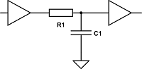
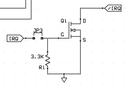

Single-board Computer (SBC) Notes
=================================

Also see:
- [Build Techniques](ee/tools/build-tech.md) (routing, bypass caps)
- [Switch Input Debouncing](debounce.md)
- [Address Decoding Notes](addr-decoding.md).
- [Capacitors](capacitor.md) (for bypass caps)

Many handy circuits for reset, clock, address decoding, interfacing,
I/O, etc. can be found in the Wilson Mines Co. [Bench-1 workbench
computer quick reference guide][Bench-1 QRG].

Contents:
- [Reset Circuits](#reset-circuits)
- [Clock Circuits](#clock-circuits)
- [Single-Step](#single-step)
- [Open-collector IRQs](#open-collector-irqs)
- [SBC Designs](#sbc-designs)

Reset Circuits
--------------

The [MOS reset circuit for the 6502][moshw 3.1] uses a pair of NAND gates
(written as ORs with inverted inputs) to debounce the switch.

The [Searle reset design][searle-6809] uses a 2k2 pullup with an NO
switch to ground, no debounce or power good.

Putting buffers/gates (particularly Schmitt trigger) on either side of
it allows high values for the resistor, thus low values for the cap,
reducing power usage and increasing accuracy. [eese 486167]

Reset circuit at [Bench-1 QRG], and several more at WMC [6502 Primer:
Reset Circuits][wmc-reset].

There are also various devices designed to do proper resets:
- __[Maxim DS1813]__ reset generator: is a 5 V 3-pin part that will pull
  down reset after a button push or voltage out-of-tolerance condition and
  after release/restoration will hold reset for 150 ms. AliExpress: ¥300+
  in TO92, ~¥130 in SMD, sometimes cheaper, but these days often more
  expensive than MCP100 below.
- __Microchip [MCP100]:__ very cheap, works properly with the 6502
  ([schematic][f65 7619]).
- __Microchip [MCP130]:__ also has an open drain output, but it doesn't
  appear to trigger a full-length reset pulse when the output is pulled
  down. AliExpress: <¥100 in TO92; ~¥25 in SMD.

Clock Circuits
--------------

More than any other, this signal is the most important to keep clean.

- Consider a 74HCT4060. The data sheet also offers some useful info on
  values for RC and oscillator/RC component combinations.

Standard pinout for a 4-pin crystal oscillator (rectangular 14-pin
footprint and square 8-pin footprint):

    ● 1  1  n/c
      7  4  GND
      8  5  output
     14  8  Vdd (+5)

It's a good idea to run the oscillator output through a '74 flip-flop
to produce a properly symmetrical clock (at half the rate). This also
allows you to replace the oscillator with a pushbutton (two presses
per clock cycle) if you're using CMOS chips that can handle a clock
halted arbitrarily long in either state.

Also see:
- Dr Jefyll, [RDY vs. Clock Stretching][stretch].

Single-Step
-----------

#### 6502

The MOS _MCS6500 Microcomputer Family Hardware Manual_ [§3.1 Static
Testing][moshw 3.1] contains a (relatively complex) single-step (both cycle
and instruction) circuit and a "data trap" to capture address and/or data
bus contents. It also details how to run reset/irq/nmi with a signal
generator to externally induce an (obviously limited) loop.

The [Woz design][ss woz] (from the Apple 1 manual) uses a single 7474 (two
flip-flops) to toggle the RDY line, optionally using SYNC and another
switch to toggle between instruction and cycle stepping. It appears that it
[may stop on the second cycle of each instruction][f65 79993] (due to φ1
clock phase) and there are other [issues with CMOS systems][f65 79991].

The [Baltissen Debugger][balt], designed for the C64 among others, latches
the display (via '573 latches) on the high half of φ2 (very useful if your
system does video on the low half) and as well as single-step includes the
ability to step to a given address set by DIP switches (via '688
comparators).

Open-collector IRQs
-------------------

You can interface an active-high always-driven IRQ line with the standard
Motorola/MOS open-collector shared IRQ line using a single MOSFET (BS170
suggested). Input from driven line to gate and a 3K3 to ground. Source to
ground, drain to open-collector IRQ bus. ([floobydust][f65 100824])

Vgs, voltage between gate and source, determines MOSFET switching.¹ On
N-channel [BS170][] Vgs < 0.8 is off, Vgs > 3 is on, giving max 5 Ω
resistance between source and drain at 10 V (max 60 Vds, 500 mA).
[2N7000][BS170] is pretty much the same except max 200 mA.

(¹ The voltage between the gate and the body of the substrate is the actual
mechanism here; the source is tied to the body to ensure no body bias.)

SBC Designs
-----------

#### Grant Searle

Minimal chip count design for 6502/[6809][searle-6809]/Z-80.

<!-------------------------------------------------------------------->
[Bench-1 QRG]: http://wilsonminesco.com/BenchCPU/B1QRG/
[Maxim DS1813]: https://datasheets.maximintegrated.com/en/ds/DS1813.pdf
[eese 486167]: https://electronics.stackexchange.com/a/486167/15390
[f65 7619]: http://forum.6502.org/viewtopic.php?f=4&t=7619
[mcp100]: https://www.microchip.com/en-us/product/MCP100
[mcp130]: https://www.microchip.com/wwwproducts/en/MCP130
[stretch]: http://forum.6502.org/viewtopic.php?f=4&t=5504#p66907
[wmc-reset]: http://wilsonminesco.com/6502primer/RSTreqs.html

<!-- Single-Step -->
[balt]: https://web.archive.org/web/20130818095847/http://www.baltissen.org:80/htm/debugger.htm
[f65 79991]: http://forum.6502.org/viewtopic.php?f=4&t=895#p79991
[f65 79993]: http://forum.6502.org/viewtopic.php?f=4&t=895#p79993
[moshw 3.1]: https://archive.org/stream/MCS6500_Family_Hardware_Manual#page/n138/mode/1up
[ss woz]: https://www.reddit.com/r/beneater/comments/foezld/wozs_circuit_to_singlestep_nmos_6502/

<!-- SBC Designs -->
[searle-6809]: http://searle.x10host.com/6809/Simple6809.html

<!-- Open-collector IRQs -->
[BS170]: https://www.vishay.com/docs/70226/70226.pdf
[f65 100824]: http://forum.6502.org/viewtopic.php?f=12&t=7622#p100824
