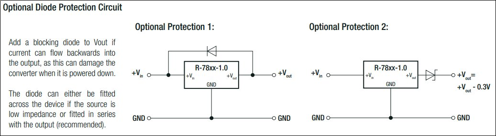
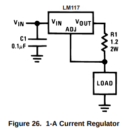

DC Power, PSUs and Batteries
============================

See [`ac-power`](./ac-power.md) for AC power information.

Abbreviations:
- `CC`=constant current. `CV`=constant voltage.
  `CP`=constant power.   `CR`=constant resistance.

Voltage Regulators
------------------

Generally voltage regulators (linear and switching) will be damaged if
biased in reverse (output voltage significantly higher than input voltage,
or sometimes even not enough lower). Reverse bias can occur if you have a
large cap on the output. As noted at [[f6 p86851]], the Recom R-78xx-1.0
datasheet offers two solutions, one keeping in ≥ out - 0.7 V via a diode
from output to input and the other keeping in ≥ out but with 0.3 V output
drop via a zener diode on the output:

Another option, if using an external PSU that produces the required
regulated voltage, is to connect it to both the output _and input_ of the
regulator, as described in [[eese 552710]]. This should still be confirmed
with the data sheet, however; it is usually safe for linear regulators, but
not for buck-boost regulators that may also pull down the output.

### Constant Current Supply

The LM317 sources the current necessary to make OUT 1.25 V higher than the
ADJ (reference pin). The standard configuration for constant voltage is a
voltage divider from OUT to system ground where the divider produces 1.25 V
when OUT is at the desired voltage level.

Connecting a resistor R between OUT and the load, with a connection from
the OUT/load node to ADJ will produce a constant-current output supplying
A = 1.25 V / R. Ensure that R can handle the maximum current output.

Sample configurations:

    R  Ω   0.47    1.0     2.2     4.7    10      22      47
       A   2.660   1.250   0.568   0.265   0.125   0.057   0.027
       W   3.32    1.56    0.71    0.71    0.16    0.07    0.03

Voltages:
- LM317 has recommended Vin - Vout of 3 V to 40 V.
- Vout = 1.25 V (dropped by R) plus Vload drops at the fixed current.
- Minimum Vin is 3 V (regulator drop) + 1.25 V (R drop) + Vload.

This will work with higher voltage regulators such as the 7805, but they
will have to drop more voltage across R and thus be more wasteful (and you
the resistor will generate more heat).

Batteries and Charging
----------------------

[Charge/discharge rate C][C-rate] is based on capacity in units of h⁻¹: for
a 2000 mAh battery, 1C = 2000 mA, C/20 = 100 mA, etc. Generally, do not draw
more than 5C unless the battery is specifically designed for high power.

Capacity generally given in mAh. Kilo-Joules give more accurate indication
of charge. `mAh = KJ / (3600 × V)`. `KJ = mAh × 3600 × V`. (Because mAh
varies with rate with some batteries?)

Over-discharge may damage some rechargable batteries.

Battery internal resistance (IR) generally increases as the cell is
discharged. Higher IR correlates with lower max discharage rates before
capacity starts falling. See, e.g., [[ds e91]].

General charging information:
- Always charge cells individually, not in series, unless you have a charge
  controller for each battery in the series.
- _Charge Control_ techniques for fast charging (C/2 to 1C):
  - Temperature sensing (rise may be hidden in hot environments)
  - -ΔV: fall in voltage indicating reached overcharge point
- Without charge control:
   - Time limit (limits overcharging time assuming the battery was discharged)
   - Standard C/10: depends on manufacturer; some handle 1 year @ C/10
   - Trickle charge (C/50 to C/20); might still cause overcharge?
     (Some manufacturers spec trickle as C/20 to C/10.)
- Pulse charging (DC pulses w/controlled rise time, frequency, amplitude)
  is used with lead-acid batteries to break down lead-sulfate crystals to
  extend life. Not clear on the advantages w/other battery types.
- For voltage depression etc. see NiCD and NiMH below.

General references:
- David Linden, Thomas B. Reddy, [_Handbook of Batteries, 3rd ed._][lin02],
  McGraw-Hill, 2002.
- George Wood Vinal, [_Storage Batteries, 4th ed._][vin55], Wiley, 1955. "A
  General Treatise on the Physics and Chemistry of Secondary Batteries and
  their Engineering Applications".

### Alkaline Cells

Voltage decreases near linearly with remaining capacity. Low currents

Voltage (per cell):
- Nominal: 1.5 V (IR: 150-300 mΩ)
- Full discharge: 0.8 V (generally accepted standard?)

References:
- Energizer [E91 datasheet][ds e91]

### Nickle-Cadmium (NiCD) Cells

General notes/comparison:
- Slightly lower internal resistance than NiMH.
- Very difficult to damage compared to other chemistries.
- Memory-backup batteries are designed for long life, low self-discharge,
  good performance at low discharge rates. Higher IR and poor
  high-discharge performance.

__Voltage:__
- Nominal: 1.2 V @ C/5
- Full Charge: ?
- Full Discharge: 1.0 V (<1V shortens cycle life)

__Discharge__ characteristics:
- 15C typ. max continouous discharge.
- Capacity (0.8-1.1 V cutoff): C/5=100%, 1C=90%, 8C=75%. [[lin02]]
- IR: low; rises significantly at 90% discharged [[lin02]]
- Subject to polarity reversal/destruction with >2 in series.
- Deep discharge ok (but not <1.0 V? [[gp]]); typ. stored fully discharged.
- Discharge life: CP = 1, CC = .8, CR = .7. [[lin02]] §28.4.7
- Voltage depression _may_ be seen if discharge terminated before 1.16 V
  (or in small amounts after that until 1.10 V). Similar may be seen with
  long-term overcharging. Both are reversable with deep cycling. [[lin02]]
- Voltage depression maybe not the same as [memory effect].

__Charging__ [[lin02]] §28.5:
- CC C/10 12-16h (140%); overcharging ok if not excessive.
  (Most cells can handle C/100 to C/3.)
- CV not recommended as can lead to thermal runaway.
  (If you try it, limit current at end of charge.)
- -ΔV usable at C/2 and above (-ΔV to low to detect below that).
- Trickle charge at C/50 to C/20, depending on frequency and depth of
  discharge. Full discharge every 6 mo. advisible.
- Fast-charge models take C/3 w/o charge control, 1C with.

__References:__
- Wikipeida, [Nickel–cadmium battery][w NiCD]
- GP Batteries, [GP Nickel Cadmium Technical Handbook][gp]

### Nickel-metal Hydride (NiMH) Cells

General:
- Vs. NiCD: ~igher specific energy and density than NiCD. Not as good for
  high-drain applications.
- Vs. alkaline: Much higher drain capability (2600 mAh alkaline drops to
  1300 mAh w/500 mA 0.2C load).
- Low internal resistance: voltage higher than alkaline at full discharge;
  alkaline battery meters over-state charge levels.
- Do not store under load (e.g., in devices w/electronic-on/off switches)
  for long periods of time; this can cause creep leakage which, while
  cosmetic only for the battery itself, can damage nearby components. [[ene18]]

__Voltage:__
- Nominal: 1.2 V (IR: 30 mΩ; increases w/discharge, decreases w/temp)
- Full charge: ~1.4 V @ C/5
- Full discharge:
  - 1.0 - 1.1 V (unloaded; maybe 0.9 V under load?; see below)
  - [[seabird]] discharger runs to 0.9 V (non-LSD cell).
  - If unloaded V < 1.0 V, battery at rest is internally corroding.
  - (Alkaline nominal is 0.8 V)

__Discharge__ characteristics:
- 5C typ. max continouous discharge.
- Avoid over-discharge; this harms the battery. In low-drain (<1C)
  applications, a 0.9 V cutoff works well. In high-drain usage (1-4C) this
  may be premature and a better cutoff is 75% of the mid-point voltage
  (between full charge voltage and start of knee of discharge) at that
  discharge rate.  [[ene18]] p.9.
- Discharge life: CP = 1, CC = .8, CR = .65. [[lin02]] §29.4.7
- Subject to polarity reversal/destruction with >2 in series.
- Self-discharge (at room temp unless otherwise indicated):
  - Regular: 5-20% on first day, then 0.5-4%/day. Proporitional to storage
    temperature (3× @ 45°).
  - Low self-discharge (LSD): retains 75-80% after 1 year. Slightly lower
    capacity due to [separator] volume.
- [Energizer NH15-2300][ds nh15] (AA 2300 mAh): flat from 2.0C to 0.1C.

Voltage depression/droop ([[seabird]] p.14):
- Minimal; usually other problems get blamed on this.
- Decrease in average battery voltage during discharge.
- From long-term storage (>30 days), overcharging, repeated partial
  discharge (end ≥1.2 V, less at ≥1.1 V), esp. at higher rates.
- Battery conditioning: full discharge followed by full charge.
  No benefit after 5× cycles; 2× usually fine after long-term storage.

__Charging:__
- [[lin02]] §29.5 P.883
- Generally similar to NiCD:
  - -Δt: less promenent "peak" than NiCD (may be absent at ≤C/3)
  - Greater temp. rise.
- Highest capacity at 150% charge input, but much longer life at 120%.
  [[ene08]] suggests 120%.
- Max ~1.55 V @ ~100% 0°C during charge cycle
- Methods:
  - -ΔV (voltage drop): requires >C/3. Typ. terminate on 10 mV/cell drop.
  - 0ΔV (voltage plateau): slope = 0 lowers risk of overcharge. May top after.
  - T (temperature cutoff), ΔT, ΔT/Δt (rate of temp increase)
  - t low-rate: C/10, time limited to 120% or 150% (see above).
  - Quick: 4-5h at 0.3C to 120% or 150%; should use -ΔV for safety;
    can top at C/10 after.
  - 0.1C to 0.3C not recommended: can overcharge but ΔV not detectable.
  - Fast: C/2 to C; essential to terminate early in overcharge.
    ΔT/Δt (1°C/min) senses overcharge faster than -ΔV.
  - Trickle: 0.03C to 0.05C indefinitely. Should still use thermal cutoff.
  - Three-step: 1: Fast. 2: C/10 topping ½-1h. 3: Trickle.
- Also see [[eese 500499]]: 6 VDC to 4× AA in series limiting current to
  C/10 = 60 mA. Highest current when batt at lowest voltage of 0.8 V/cell,
  3.2 V for the "pack," thus R = V/I = (6.0 - 3.2) / .06 = 47 Ω. But rate
  power for full 6 V: P = V²/R = 6²/47 = .8 W.

__Packages:__

IEC names designate type (NiMH) and size.

     mAh  IEC size  brand/model                     manuf. sugg. charge
    ─────────────────────────────────────────────────────────────────────────
     700  HR03 AAA  GP                              16h @ 70 mA
     750  HR03 AAA  Eneloop BK-4MCC
     800  HR03 AAA  EBL
    1100  HR03 AAA  EBL
    1900  HR6  AA   Amazon Basics (white)
    2000  HR6  AA   Amazon Basics (black)           16h @ 200 mA
    2050  HR6  AA   GP ReCyclo+                     16h @ 200 mA
    2400  HR6  AA   Amazon Basics High Cap (green)  16h @ 240 mA
    2400  HR6  AA   Toshiba Impulse
    2800  HR6  AA   EBL (extra thick)

__References:__
- [Wikipedia][w NiMH].
- Linden, Reddy, _Handbook of Batteries, 3rd ed._ (2002) [Ch. 29: Portable
  Sealed Nickel-Metal Hydride Batteries][lin02§29].
- Energizer, [_Nickel Metal Hydride (NiMNH) Handbook and Application
  Manual_][ene18], 2018.
- Energizer, [_NiMH Battery Chargers Handbook and Application
  Manual_][ene08], 2008.
- EE.SE [Is voltage an accurate metric for testing the charge of an NiMH
  battery?][eese 291808]
- [Upcycling of Spent NiMH Battery Material—Reconditioned Battery Alloys
  Show Faster Activation and Reaction Kinetics than Pristine
  Alloys][PMC7288010]
- YouTube: bigclivedotcom, [Simple NiMH battery charger (with PCB
  files)][wVnAH17f4jg]. Schematic at 1:04. 20-30 mA charge current from USB
  PSU, w/diodes to prevent backfeed so you can parallel as many of these as
  you like. +5V → 1N400X →  (120R | LED → 120R) → cell → GND.

### Lithium-Ion and Lithium-Polymer Cells

__Voltage:__
- Nominal: 3.6 / 3.7 / 3.8 / 3.85 V; LiFePO4 3.2 V; Li4Ti5O12 2.3 V

__References:__
- STM [L6924D Battery charger system for Li-ion/LiPo][ds L6924D]

<!-------------------------------------------------------------------->

<!-- Voltage Regulators -->
[LM317]: https://www.ti.com/lit/ds/symlink/lm317.pdf
[eese 552710]: https://electronics.stackexchange.com/a/552710/15390
[f6 p86851]: http://forum.6502.org/viewtopic.php?f=12&t=6760#p86851

<!-- Batteries and Charging -->
[C-rate]: https://en.wikipedia.org/wiki/Battery_charger#C-rate
[lin02]: https://archive.org/details/handbookofbatter0000unse/
[memory effect]: https://en.wikipedia.org/wiki/Memory_effect
[vin55]: https://archive.org/details/storagebatteries0000vina/page/n5/mode/2up

<!-- Alkaline Cells -->
[ds e91]: https://data.energizer.com/pdfs/e91.pdf

<!-- Nickle-Cadmium (NiCD) Cells -->
[gp]: https://web.archive.org/web/20070927222904/http://www.gpbatteries.co.uk/downloads/technical_handbooks/GP_NiCd_Technical.pdf
[w NiCD]: https://en.wikipedia.org/wiki/Nickel%E2%80%93cadmium_battery#Characteristics
[w NiCD]: https://en.wikipedia.org/wiki/Nickel%E2%80%93cadmium_battery#Characteristics

<!-- Nickel-metal Hydride (NiMH) Cells -->
[PMC7288010]: https://www.ncbi.nlm.nih.gov/pmc/articles/PMC7288010/
[ds nh15]: https://data.energizer.com/pdfs/nh15-2300.pdf
[eese 291808]: https://electronics.stackexchange.com/q/291808/15390
[eese 500499]: https://electronics.stackexchange.com/a/500499/15390
[ene08]: https://data.energizer.com/pdfs/charger_appman.pdf
[ene18]: https://data.energizer.com/pdfs/nickelmetalhydride_appman.pdf
[lin02§29]: https://archive.org/details/handbookofbatter0000unse/page/n862/mode/1up?view=theater
[seabird]: http://www.seabird.com/pdf_documents/manuals/NiMH_002.pdf
[separator]: https://en.wikipedia.org/wiki/Separator_(electricity)
[wVnAH17f4jg]: https://www.youtube.com/watch?v=wVnAH17f4jg
[w NiMH]: https://en.wikipedia.org/wiki/Nickel%E2%80%93metal_hydride_battery

<!-- Lithium-Ion and Lithium-Polymer Cells -->
[ds L6924D]: https://www.st.com/resource/en/datasheet/l6924d.pdf
