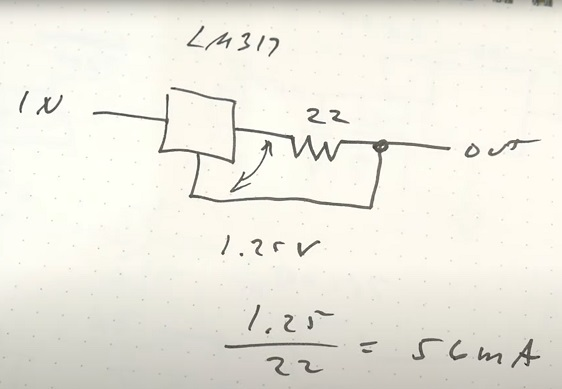

DC Power, PSUs and Batteries
============================

See [`ac-power`](./ac-power.md) for AC power information.

Voltage Regulators
------------------

Generally voltage regulators (linear and switching) will be damaged if
biased in reverse (output voltage significantly higher than input voltage,
or sometimes even not enough lower). As noted at [[f6 p86851]], the Recom
R-78xx-1.0 datasheet offers two solutions, one keeping in ≥ out - 0.7 V via
a diode from output to input and the other keeping in ≥ out but with 0.3 V
output drop via a zener diode on the output:

Another option, if using an external PSU that produces the required
regulated voltage, is to connect it to both the output _and input_ of the
regulator, as described in [[eese 552710]]. This should still be confirmed
with the data sheet, however; it is usually safe for linear regulators, but
not for buck-boost regulators that may also pull down the output.

### Constant Current Supply

The LM317 maintains a constant 1.25 V between the reference pin and the
output pin; this can set the output to any arbitrary voltage by putting the
reference in the middle of a voltage divider between output and ground.

However, if you connect the output to the reference via a resistor R (with
no connection to ground) you'll produce a constant current power supply
supplying A = 1.25 V / R.

This will work with higher voltage regulators such as the 7805, but they
will have to drop more voltage across R and thus be more wasteful (and you
the resistor will generate more heat).

<!-------------------------------------------------------------------->
<!-- Voltage Regulators -->
[f6 p86851]: http://forum.6502.org/viewtopic.php?f=12&t=6760#p86851
[eese 552710]: https://electronics.stackexchange.com/a/552710/15390
