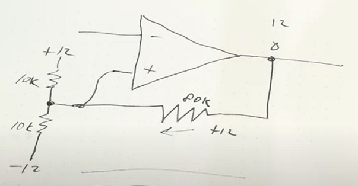

Operational Amplifiers
======================

__Rule:__ No current flows in to our out of the inputs.

- As a comparator: output indicates V+ > V-: i.e., near Vcc if true,
  near GND if false.

        |\
    ----|+\
        |  \___
        |  /
    ----|-/
        |/

### Comparators vs. Op-Amps

Comparators are:[[ig1086]]
- at least 10x faster
- won't get stuck on a rail (op-amps don't like to go full swing)
- usually open-collector output

Comparator hysteresis:  

Build Notes
-----------

- Use a bypass cap near supply pin?

Parts Guide
-----------

### LM324

* LM324N (14): Low-power quad operational amplifier
  - Pins: `O1 I1- I1+ V+ I2+ I2- O2 ‥ O3 I3- I3+ GND I4+ I4- O4`

References
----------

* [[ig1086]] IMSAI Guy #1086 Comparator Hysteresis

<!-------------------------------------------------------------------->
[TI LM324-N-MIL]: https://www.ti.com/lit/ds/symlink/lm324-n-mil.pdf
[ig1086]: https://www.youtube.com/watch?v=mnRO1OK6bqY
