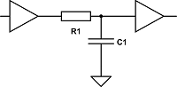

Single-board Computer (SBC) Notes
=================================

Also see:
- [Switch Input Debouncing](debounce.md)
- [Address Decoding Notes](addr-decoding.md).
- [Capacitors](capacitor.md) (for bypass caps)

Many handy circuits for reset, clock, address decoding, interfacing,
I/O, etc. can be found in the Wilson Mines Co. [Bench-1 workbench
computer quick reference guide][Bench-1 QRG].

Reset Circuits
--------------

The [Searle reset design][searle-6809] uses a 2k2 pullup with an NO
switch to ground, no debounce or power good.

Putting buffers/gates (particularly Schmitt trigger) on either side of
it allows high values for the resistor, thus low values for the cap,
reducing power usage and increasing accuracy. [eese 486167]

Reset circuit at [Bench-1 QRG], and several more at WMC [6502 Primer:
Reset Circuits][wmc-reset].

The [Maxim DS1813] reset generator (~¥120/ea on Aliexpress) is a 5 V
3-pin part that will pull down reset after a button push or voltage
out-of-tolerance condition and after release/restoration will hold
reset for 150 ms. AliExpress: ¥300+ in TO92, ~¥130 in SMD.

There's also the Microchip [MCP130]. It also has an open drain output,
but it doesn't appear to trigger a full-length reset pulse when the
output is pulled down. AliExpress: <¥100 in TO92; ~¥25 in SMD.

Clock Circuits
--------------

- Consider a 74HCT4060. The data sheet also offers some useful info on
  values for RC and oscillator/RC component combinations.

Standard pinout for a 4-pin crystal oscillator (rectangular 14-pin
footprint and square 8-pin footprint):

    ● 1  1  n/c
      7  4  GND
      8  5  output
     14  8  Vdd (+5)

It's a good idea to run the oscillator output through a '74 flip-flop
to produce a properly symmetrical clock (at half the rate). This also
allows you to replace the oscillator with a pushbutton (two presses
per clock cycle) if you're using CMOS chips that can handle a clock
halted arbitrarily long in either state.

Also see:
- Dr Jefyll, [RDY vs. Clock Stretching][stretch].

SBC Designs
-----------

#### Grant Searle

Minimal chip count design for 6502/[6809][searle-6809]/Z-80.

<!-------------------------------------------------------------------->
[Bench-1 QRG]: http://wilsonminesco.com/BenchCPU/B1QRG/
[Maxim DS1813]: https://datasheets.maximintegrated.com/en/ds/DS1813.pdf
[eese 486167]: https://electronics.stackexchange.com/a/486167/15390
[mcp130]: https://www.microchip.com/wwwproducts/en/MCP130
[searle-6809]: http://searle.x10host.com/6809/Simple6809.html
[stretch]: http://forum.6502.org/viewtopic.php?f=4&t=5504#p66907
[wmc-reset]: http://wilsonminesco.com/6502primer/RSTreqs.html
