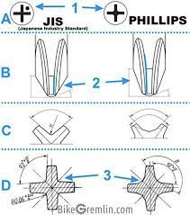

### Cross-Recessed Head Screws

- Phillips
  - Approx 30° angle from vertical at tip.
- [JIS B 1012]
  - Approx 45° angle from vertical at tip.
  - screws identified by a dot or "X" next to cross slot
  - can be used on Phillips screws
  - obsoleted by nearly identical ISO 8767-1
- [ISO 8764-1] drivers for cross-recessed head screws ([ISO 4757])
  - nearly identical to JIS B 1012
  - PH for H recesses (look like Phillips)
  - PZ for Z recesses (look like Posidrive)

Diagram:

<!-------------------------------------------------------------------->
[JIS B 1012]: https://en.wikipedia.org/wiki/List_of_screw_drives#JIS_B_1012
[ISO 8764-1]: https://cdn.standards.iteh.ai/samples/37562/1b12535b14e946d38e404288c41ce8e7/ISO-8764-1-2004.pdf
[ISO 8764-2]: https://cdn.standards.iteh.ai/samples/37556/dd6b8591fa2c47929844a3d8db938c9b/ISO-8764-2-2004.pdf
[ISO 4757]: https://cdn.standards.iteh.ai/samples/10742/d878fa0371e041b39de75de4d4426928/ISO-4757-1983.pdf
