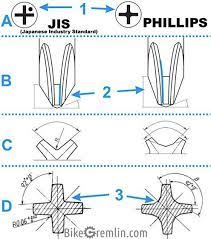

### Cross-Recessed Head Screws

- Phillips
  - Approx 30° angle from vertical at tip.
- [JIS B 1012]
  - Approx 45° angle from vertical at tip.
  - screws identified by a dot or "X" next to cross slot
  - can be used on Phillips screws
  - obsoleted by nearly identical ISO 8767-1
- [ISO 8764-1] drivers for cross-recessed head screws ([ISO 4757])
  - nearly identical to JIS B 1012
  - PH for H recesses (look like Phillips)
  - PZ for Z recesses (look like Posidrive)

Diagram:

### Bit Holders, Bits and Shanks

ISO 1173 specifies bit shank sizes and designs. The major ones are:

Sizes ({minimum length]minimum length in {braces:
- __4 mm__ ("mini hex", "micro hex"). Min. len 9 mm. Used in common
  jewelers'/electronics multi-bit and driver sets. This may have a small
  spring-loaded ball in the shank to help a little in locking it, but most
  bits do not have this.
- __6.3 mm__ (1/4"): Min len. C=11mm, E=25mm. Used by impact drivers, power
  drills and 'regular' size nut driver hand tools and their bit sets.
- Other sizes include  7.94 mm (5/16"), 8mm, 11.02 mm (7/16"), 11.2 mm.

Shanks:
- __Form C:__ Bits often very small, 1-2 cm long. Friction or magnetic fit.
- __Form E:__ Larger bits with a detent for a ball in the driver, used as a
  latching mechanism to keep it from falling out. There are other similar
  designs, but since 2010 form E is the most commonly used.

References:
- Wikipedia, [Screwdriver bit § Bit shank standards].
- AIMS, [Magnetic Nutsetter & Bit Holder Guide].

<!-------------------------------------------------------------------->
[ISO 4757]: https://cdn.standards.iteh.ai/samples/10742/d878fa0371e041b39de75de4d4426928/ISO-4757-1983.pdf
[ISO 8764-1]: https://cdn.standards.iteh.ai/samples/37562/1b12535b14e946d38e404288c41ce8e7/ISO-8764-1-2004.pdf
[ISO 8764-2]: https://cdn.standards.iteh.ai/samples/37556/dd6b8591fa2c47929844a3d8db938c9b/ISO-8764-2-2004.pdf
[JIS B 1012]: https://en.wikipedia.org/wiki/List_of_screw_drives#JIS_B_1012
[Screwdriver bit § Bit shank standards]: https://en.wikipedia.org/wiki/Screwdriver_bit#Bit_shank_standards
[Magnetic Nutsetter & Bit Holder Guide]: https://aimsindustrial.com.au/blogs/product-guides/magnetic-nutsetter-bit-holder-guide
