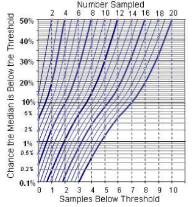

Measurement Notes
=================

How to Measure Anything
-----------------------

* [How to Measure Anything: Finding the Value of Intangibles in Business
  3rd Edition][htma]
  * [TAC presentation][htma-tac] summrizing bits of above
* [How to Measure Anything in Cybersecurity Risk 1st Edition][htma-cs]

#### 'Math-less' Statistics Table

'nth value' is nth largest and smallest sample values to take as
edges of range.

| Sample Size | nth value | confidence
|------------:|-----------|------------
|           5 | 1         | .938
|           8 | 2         | .930
|          11 | 3         | .935
|          13 | 4         | .908
|          16 | 5         | .923
|          18 | 6         | .904
|          21 | 7         | .922
|          23 | 8         | .907

#### Measuring to Threshold

[htma]: https://smile.amazon.com/dp/B00INUYS2U/
[htma-cs]: https://smile.amazon.com/dp/B01J4XYM16
[htma-tac]: http://www.hubbardresearch.com/wp-content/uploads/2011/08/TAC-How-To-Measure-Anything.pdf
